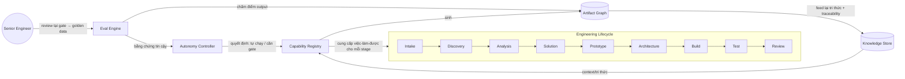
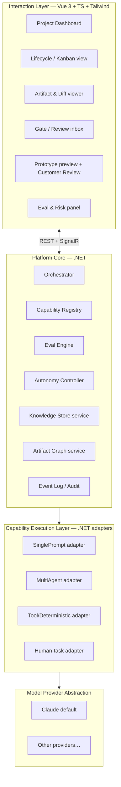

# 01 — Foundation Architecture

## 1. Năm trụ và cách chúng ghép nhau



Diễn giải một câu cho mỗi trụ:

- **Engineering Lifecycle** — bộ khung giai đoạn (Intake…Review) mà mọi project chảy qua.
- **Capability** — đơn vị việc-làm-được, gắn vào từng stage; đây là thứ mở rộng theo thời gian.
- **Knowledge** — tri thức nuôi capability (nghiệp vụ, pattern, quyết định cũ) và nhận lại artifact.
- **Eval** — đo chất lượng artifact; sinh "bằng chứng tin cậy".
- **Autonomy** — dựa trên bằng chứng eval + phân loại rủi ro để quyết định capability được tự chạy tới đâu.

## 2. Layered Architecture



**Nguyên tắc phân tầng:**

1. **Interaction Layer** không chứa logic nghiệp vụ; chỉ hiển thị trạng thái và thu review.
2. **Platform Core** là phần *phải ổn định* — nó chỉ biết về Capability/Artifact/Eval/Autonomy/Knowledge như những **abstraction**, không biết capability cụ thể được thực thi thế nào.
3. **Execution Layer** là nơi "bẩn tay": adapter dịch một `CapabilityRun` thành lời gọi prompt / multi-agent / tool / human-task. **Đây là chỗ multi-agent sống — và bị giấu khỏi Core.**
4. **Provider Abstraction** khóa mọi lời gọi model sau một interface duy nhất → đổi model không lan lên trên.

## 3. Trách nhiệm từng thành phần Core

| Thành phần | Trách nhiệm | KHÔNG làm |
|---|---|---|
| **Orchestrator** | Chạy project qua lifecycle; chọn capability kế tiếp; chèn gate; xử lý HITL | Không tự thực thi model |
| **Capability Registry** | Lưu định nghĩa capability (contract, autonomy, eval ref); resolve adapter | Không giữ state của project |
| **Eval Engine** | Chạy checks + rubric + LLM-judge; lưu `EvalResult`; tính điểm tin cậy | Không quyết định gate (chỉ cung cấp bằng chứng) |
| **Autonomy Controller** | Từ eval + risk → quyết mức tự chủ & có cần gate không | Không chấm điểm |
| **Knowledge Store** | Lưu/ truy vấn tri thức project + org (RAG) | Không sinh artifact |
| **Artifact Graph** | Lưu artifact có version + cạnh truy vết | Không đánh giá chất lượng |
| **Event Log / Audit** | Ghi mọi hành động (ai/gì/khi nào) — bất biến | — |

## 4. Ánh xạ sang .NET Solution

`⚠️ OPEN DECISION`: tên/độ mịn project có thể chỉnh. Đề xuất khởi điểm:

```
AiSep.sln
├─ src/
│  ├─ AiSep.Domain            // Capability, Artifact, Eval, Autonomy — pure model, KHÔNG phụ thuộc gì
│  ├─ AiSep.Application       // Orchestrator, use-cases, interfaces (ports)
│  ├─ AiSep.Infrastructure    // EF Core, Knowledge Store, Event Log, provider clients
│  ├─ AiSep.Capabilities      // Định nghĩa + adapter các capability cụ thể
│  ├─ AiSep.Providers         // Provider abstraction + Claude adapter
│  └─ AiSep.Api               // ASP.NET Core: REST + SignalR hub
├─ web/                       // Vue 3 + TS + Tailwind
└─ docs/
```

Kiến trúc theo **Clean/Onion**: `Domain` ở lõi, không tham chiếu ra ngoài; `Application` định nghĩa *ports* (interface); `Infrastructure`/`Providers` cắm *adapters*. Điều này thực thi trực tiếp NT1 (Capability-first) và Provider Abstraction ở mức code.

## 5. Cách một project chảy qua hệ thống (tóm tắt)

1. Con người tạo project + nạp đầu vào (idea/BA/prototype/source) → Intake capability phân loại, tạo artifact gốc.
2. Orchestrator hỏi Registry: "ở stage này, capability nào chạy được với input hiện có?"
3. Autonomy Controller quyết: tự chạy hay dừng ở gate.
4. Execution adapter chạy capability → sinh artifact mới (nối vào Artifact Graph).
5. Eval Engine chấm artifact → điểm + cờ rủi ro.
6. Nếu cần gate → đẩy vào Review inbox của senior engineer (SignalR realtime).
7. Quyết định review → cập nhật state + ghi golden data → quay lại (2).

Chi tiết vòng lặp: [04 — Orchestration](04-knowledge-and-orchestration.md).
