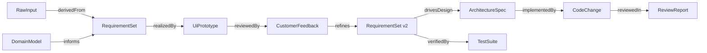

# 02 — Capability & Artifact (Contract lõi)

> Đây là **trái tim** của platform. Nếu hai contract này đúng, mọi thứ khác cắm vào được. Nếu sai, refactor rất đau. Ưu tiên review kỹ file này.

## 1. Capability — định nghĩa

Một **Capability** là *một đơn vị công việc kỹ thuật platform thực hiện được*, mô tả **hoàn toàn khai báo (declarative)** — không dính tới cách thực thi.

```csharp
public sealed record CapabilityDefinition
{
    public required CapabilityId Id { get; init; }          // vd "requirement.analyze"
    public required string DisplayName { get; init; }
    public required LifecycleStage Stage { get; init; }     // Intake, Analysis, Prototype, ...

    // HỢP ĐỒNG DỮ LIỆU — điều kiện chạy & sản phẩm
    public required InputContract Input { get; init; }      // cần artifact/loại nào để đủ điều kiện
    public required OutputContract Output { get; init; }    // sinh ra ArtifactType gì

    // TRI THỨC & CHI PHÍ
    public IReadOnlyList<KnowledgeRef> KnowledgeRefs { get; init; } = [];
    public required CostBudget Budget { get; init; }        // trần tokens / tiền / thời gian

    // CHẤT LƯỢNG & TỰ CHỦ
    public required EvalSpec Eval { get; init; }            // đo output thế nào (xem 03)
    public required RiskClass Risk { get; init; }           // rủi ro nội tại (gate cứng nếu cao)
    public AutonomyLevel DefaultAutonomy { get; init; } = AutonomyLevel.Supervised;

    // THỰC THI — chỉ trỏ tới adapter, KHÔNG mô tả nội dung
    public required ExecutionBinding Execution { get; init; }
}
```

Điểm mấu chốt: **`CapabilityDefinition` không chứa prompt, không chứa agent.** Nó chỉ *trỏ* tới `ExecutionBinding`. Đây là nơi NT1 (Capability-first) được cưỡng chế ở mức type.

```csharp
public sealed record ExecutionBinding
{
    public required ExecutionKind Kind { get; init; }   // SinglePrompt | MultiAgent | Tool | Human
    public required string AdapterKey { get; init; }    // Registry resolve ra adapter cụ thể
    public JsonElement Config { get; init; }            // prompt template ref, agent graph, tool id...
}

public enum ExecutionKind { SinglePrompt, MultiAgent, Tool, Human }
```

> 💡 Đổi một capability từ 1 prompt sang multi-agent = đổi `Execution.Kind` + `Config`. **Contract, eval, autonomy, artifact — không đổi.** Đúng tinh thần "Multi-Agent chỉ là cơ chế thực thi".

### Input / Output Contract

```csharp
public sealed record InputContract
{
    // Các loại artifact bắt buộc phải tồn tại trong project để capability đủ điều kiện chạy
    public required IReadOnlyList<ArtifactType> Requires { get; init; }
    // Tùy chọn — nếu có thì dùng, không thì thôi (khám phá từ thông tin thiếu — NT2)
    public IReadOnlyList<ArtifactType> Optional { get; init; } = [];
    // Điều kiện bổ sung (vd "reqs đã được approve")
    public IReadOnlyList<Precondition> Preconditions { get; init; } = [];
}

public sealed record OutputContract
{
    public required ArtifactType Produces { get; init; }
    public required JsonSchema Schema { get; init; }   // schema JSON cho phần structured của artifact
}
```

`InputContract` chính là cơ chế cho **NT2**: capability tự biết mình *đủ điều kiện* hay chưa. Thiếu input bắt buộc → Orchestrator chạy capability "hỏi để bổ sung" thay vì bịa.

## 2. CapabilityRun — một lần thực thi

`CapabilityDefinition` là *tĩnh*; mỗi lần chạy sinh một `CapabilityRun` (có state, có audit).

```csharp
public sealed record CapabilityRun
{
    public required RunId Id { get; init; }
    public required CapabilityId Capability { get; init; }
    public required ProjectId Project { get; init; }
    public required IReadOnlyList<ArtifactRef> Inputs { get; init; }
    public RunStatus Status { get; init; }             // Pending, Running, AwaitingGate, Evaluated, Approved, Rejected, Failed
    public ArtifactRef? Output { get; init; }
    public EvalResultId? Eval { get; init; }
    public CostActual Cost { get; init; }              // token/$/time thực tế đã tiêu
    public AutonomyLevel EffectiveAutonomy { get; init; }
    public IReadOnlyList<RunEvent> Trace { get; init; } = []; // audit từng bước
}
```

## 3. Artifact — sản phẩm có kiểu & version

Mọi thứ AI (hoặc người) tạo ra đều là **Artifact**. Không có "output trôi nổi".

```csharp
public sealed record Artifact
{
    public required ArtifactId Id { get; init; }
    public required ArtifactType Type { get; init; }        // xem catalogue bên dưới
    public required ProjectId Project { get; init; }
    public required int Version { get; init; }              // immutable; sửa = version mới
    public required ArtifactId? SupersededBy { get; init; }  // trỏ tới version kế tiếp (nếu có)

    public required ArtifactContent Content { get; init; }   // structured (JSON theo schema) + blob (file/HTML/code)
    public required ProvenanceInfo Provenance { get; init; } // do RunId nào sinh, dùng model gì, khi nào
    public IReadOnlyList<ArtifactEdge> Edges { get; init; } = []; // truy vết (xem mục 5)
    public ArtifactStatus Status { get; init; }             // Draft, UnderReview, Approved, Rejected, Superseded
}
```

### Catalogue ArtifactType (v1)

| ArtifactType | Stage sinh ra | Nội dung chính |
|---|---|---|
| `RawInput` | Intake | idea/BA/prototype/source thô + phân loại |
| `DomainModel` | Discovery | thực thể nghiệp vụ, thuật ngữ, luật |
| `RequirementSet` | Analysis | user stories / reqs có ID, ưu tiên, tiêu chí chấp nhận |
| `OpenQuestions` | Analysis | câu hỏi cho con người/khách hàng (NT2) |
| `SolutionProposal` | Solution | 1..n phương án, trade-off, khuyến nghị |
| `UiPrototype` | Prototype | HTML/UI clickable + map req↔screen |
| `CustomerFeedback` | Prototype | phản hồi có cấu trúc từ customer review |
| `ArchitectureSpec` | Architecture | thành phần, tech, ADR |
| `CodeChange` | Build | diff/patch + mô tả |
| `TestSuite` | Test | test + kết quả chạy |
| `ReviewReport` | Review | self-review, risk flags, checklist |

> 💡 Catalogue này *mở rộng được* — thêm type mới không phá contract. Đây là cách platform lớn lên mà nền không đổi.

## 4. Ví dụ đầy đủ: capability `requirement.analyze`

```jsonc
{
  "id": "requirement.analyze",
  "displayName": "Phân tích yêu cầu",
  "stage": "Analysis",
  "input": {
    "requires": ["RawInput"],
    "optional": ["DomainModel"],          // có domain model thì tốt, không có vẫn chạy (NT2)
    "preconditions": []
  },
  "output": {
    "produces": "RequirementSet",
    "schema": "schemas/requirement-set.schema.json"
  },
  "knowledgeRefs": [
    { "scope": "org", "tag": "requirement-patterns" },
    { "scope": "project", "tag": "domain-glossary" }
  ],
  "budget": { "maxTokens": 120000, "maxUsd": 1.5, "maxSeconds": 180 },
  "eval": {
    "checks": ["schema-valid", "every-req-has-acceptance-criteria", "no-orphan-requirement"],
    "rubric": "rubrics/requirement-quality.md",
    "judge": { "model": "provider-default", "passThreshold": 0.8 },
    "humanGate": "required"
  },
  "risk": "Low",
  "defaultAutonomy": "Supervised",
  "execution": {
    "kind": "SinglePrompt",               // sau này có thể đổi thành MultiAgent mà không phá gì
    "adapterKey": "prompt.requirement-analyze.v1",
    "config": { "promptTemplate": "prompts/requirement-analyze.v1.md" }
  }
}
```

Cùng capability, khi muốn mạnh hơn:

```jsonc
"execution": {
  "kind": "MultiAgent",
  "adapterKey": "graph.requirement-analyze.v2",
  "config": { "graph": "graphs/req-analyze-fanout.json" }   // researcher + analyst + critic
}
```

→ Dashboard, eval, artifact, autonomy: **không thay đổi một dòng**.

## 5. Traceability — Artifact Graph

Các cạnh (`ArtifactEdge`) tạo đồ thị truy vết end-to-end:



Loại cạnh (v1): `derivedFrom`, `informs`, `realizedBy`, `reviewedBy`, `refines`, `drivesDesign`, `implementedBy`, `verifiedBy`, `reviewedIn`, `supersedes`.

**Vì sao quan trọng:**
- **Review:** senior engineer bấm một requirement → thấy ngay màn hình/code/test liên quan.
- **Eval:** "code này có thỏa requirement gốc không?" trả lời được vì có cạnh `implementedBy`.
- **Impact analysis:** requirement đổi → biết artifact nào phải làm lại.
- **Vòng lặp customer:** `CustomerFeedback --refines--> RequirementSet v2` bắt sai yêu cầu *trước khi* code.

## 6. Ba bất biến của contract lõi (đừng phá)

1. **Capability khai báo, không mô tả cách thực thi** — cách làm nằm sau `ExecutionBinding`.
2. **Artifact bất biến + có version** — sửa là tạo version mới, không ghi đè (audit & rollback).
3. **Không output trôi nổi** — mọi sản phẩm là Artifact có type, có provenance, có cạnh truy vết.
