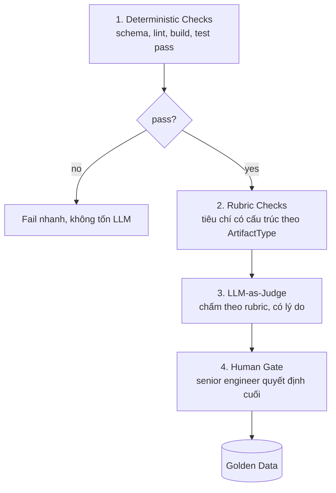

# 03 — Eval & Autonomy

> Eval là **moat** của platform. Autonomy chỉ được nâng khi Eval cho phép. Hai thứ này khóa chặt nhau.

## 1. Vì sao Eval là trung tâm

Không có Eval đáng tin → không thể để AI tự chạy → platform mãi ở mức "AI gợi ý, người làm lại". Có Eval đáng tin → nâng autonomy an toàn → platform tự làm nhiều hơn **mà không đổi kiến trúc**. Đây chính là cơ chế biến luận điểm autonomy (xem [00](00-vision-and-principles.md#4)) thành hiện thực đo được.

## 2. Bốn tầng đánh giá một artifact

Chạy từ rẻ→đắt, dừng sớm nếu tầng dưới fail:



| Tầng | Ví dụ | Chi phí | Ai chạy |
|---|---|---|---|
| **Deterministic** | JSON hợp schema, code build/lint/test pass, mọi req có acceptance criteria | ~0 | máy |
| **Rubric** | "mọi màn hình prototype map được về ≥1 req", "không req mồ côi" | thấp | máy/LLM |
| **LLM-as-Judge** | chấm độ đầy đủ/rõ ràng/khả thi theo rubric, kèm lý do & trích dẫn | trung bình | LLM |
| **Human Gate** | senior engineer approve/reject + ghi chú | cao (thời gian người) | người |

```csharp
public sealed record EvalResult
{
    public required EvalResultId Id { get; init; }
    public required RunId Run { get; init; }
    public required ArtifactRef Artifact { get; init; }
    public required IReadOnlyList<CheckResult> Checks { get; init; }  // deterministic + rubric
    public JudgeVerdict? Judge { get; init; }                         // điểm 0..1 + reasons + citations
    public double Confidence { get; init; }                           // tổng hợp → dùng cho Autonomy
    public HumanDecision? Human { get; init; }                        // Approve/Reject + notes (nếu có gate)
}
```

## 3. Golden Data — vòng lặp học

Mỗi `HumanDecision` tại gate được lưu kèm artifact + eval tự động tương ứng. Theo thời gian đây là **bộ dữ liệu vàng** để:

- **Hiệu chỉnh LLM-judge:** so điểm judge với quyết định người → phát hiện judge quá dễ/khó.
- **Đo độ tin cậy thật của một capability:** tỉ lệ "judge pass ⇒ người cũng approve".
- **Là điều kiện tốt nghiệp autonomy** (mục 5).

> Không cần fine-tune model. Golden data dùng để *hiệu chỉnh ngưỡng và rubric*, và để báo cáo độ tin cậy — thuần engineering, không cần ML pipeline nặng.

## 4. Autonomy Ladder

```
L0 Manual      — người làm, platform chỉ lưu artifact + truy vết.
L1 Assisted    — AI nháp, người viết bản cuối.
L2 Supervised  — AI làm trọn, BẮT BUỘC dừng ở gate chờ người duyệt.   ← mặc định an toàn
L3 Autonomous  — AI làm trọn, tự đi tiếp; người được thông báo, veto bất đồng bộ.
```

- Mỗi capability có `DefaultAutonomy` (thường **L2**).
- **Autonomy hiệu lực** cho một run do `Autonomy Controller` tính, không phải cố định.

## 5. Cơ chế "tốt nghiệp" Autonomy

```csharp
// Pseudo — Autonomy Controller
AutonomyLevel Resolve(CapabilityDefinition cap, ProjectContext ctx)
{
    // (1) Rủi ro cao → luôn gate, bất kể eval tốt tới đâu
    if (cap.Risk >= RiskClass.High) return AutonomyLevel.Supervised;

    // (2) Ngân sách cạn / vượt trần → hạ tự chủ
    if (ctx.BudgetNearlyExhausted) return AutonomyLevel.Assisted;

    // (3) Bằng chứng eval: track record của capability này
    var stats = evalHistory.For(cap.Id, ctx.OrgOrProjectScope);
    //   - đủ mẫu (n >= minSamples)
    //   - tỉ lệ người-đồng-ý-với-judge cao (>= promoteThreshold)
    //   - không có regression gần đây
    if (stats.CanPromoteToAutonomous)
        return AutonomyLevel.Autonomous;   // L3

    return cap.DefaultAutonomy;            // thường L2
}
```

Nguyên tắc:
- **Rủi ro cứng thắng eval:** capability đụng tới thứ nguy hiểm (vd ghi vào source có sẵn, xóa dữ liệu) **luôn** gate dù eval hoàn hảo.
- **Tốt nghiệp cần bằng chứng, có thể xuống hạng:** đủ mẫu + tỉ lệ đồng thuận cao mới lên L3; có regression thì tự động rớt về L2.
- **Phạm vi tốt nghiệp:** `⚠️ OPEN DECISION` — tốt nghiệp theo **org** (mọi project hưởng) hay theo **project**? Đề xuất: org-level với sàn tối thiểu, project có thể override xuống.

## 6. Risk Classification

| RiskClass | Đặc điểm | Gate |
|---|---|---|
| `Low` | chỉ sinh tài liệu/nháp, không đụng hệ thống thật | có thể L3 |
| `Medium` | sinh code mới trong sandbox/dự án mới | thường L2 |
| `High` | sửa source code hiện có, đụng dữ liệu/cấu hình thật | **luôn gate** |
| `Critical` | hành động không thể đảo ngược (deploy, xóa) | **ngoài scope v1** |

## 7. Cost Budget (kiểm soát rủi ro chi phí)

Risk control không chỉ là "đúng/sai" mà còn là **tiền & thời gian**. Mỗi capability khai báo `CostBudget`; mỗi run theo dõi `CostActual`. Vượt trần → run dừng, hạ autonomy, hoặc hỏi người. Dashboard hiển thị chi phí lũy kế theo project — để senior engineer thấy "AI đang đốt bao nhiêu".
