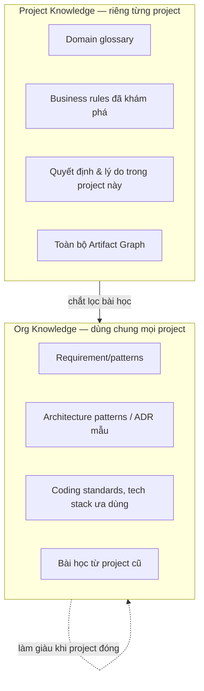
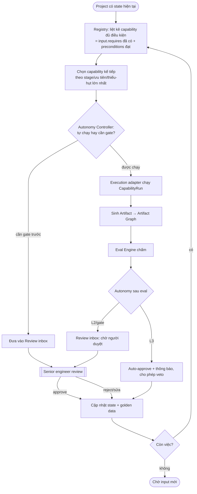

# 04 — Knowledge & Orchestration

## Phần A — Knowledge Store

### 1. Hai phạm vi tri thức



- **Project scope** — sinh ra & tiêu thụ trong vòng đời một project (chính là Artifact Graph + ghi chú).
- **Org scope** — tri thức tái dùng; project mới thừa hưởng ngay. Khi project đóng, một capability "chắt lọc bài học" đề xuất đưa gì lên org (có gate người duyệt — tránh nhiễm tri thức rác).

### 2. Truy xuất (RAG)

Capability khai báo `KnowledgeRefs` (scope + tag). Knowledge Store trả về context liên quan qua truy vấn hỗn hợp:

- **Structured lookup** — theo type/tag/quan hệ trong Artifact Graph (chính xác, rẻ).
- **Semantic search** — vector embedding cho tri thức dạng văn bản.

`⚠️ OPEN DECISION` — hạ tầng vector: (a) `pgvector` trong Postgres (một DB, đơn giản, đủ cho quy mô team) — **đề xuất**; (b) vector DB riêng (Qdrant/…) nếu sau này cần quy mô lớn.

### 3. Lược đồ lưu trữ (khái niệm)

```csharp
public sealed record KnowledgeItem
{
    public required KnowledgeId Id { get; init; }
    public required KnowledgeScope Scope { get; init; }   // Org | Project
    public ProjectId? Project { get; init; }              // null nếu Org
    public required IReadOnlyList<string> Tags { get; init; }
    public required KnowledgeKind Kind { get; init; }      // Glossary, Rule, Pattern, Lesson, ...
    public required string Body { get; init; }
    public float[]? Embedding { get; init; }
    public required ProvenanceInfo Provenance { get; init; }  // từ artifact/run nào ra
}
```

---

## Phần B — Orchestration

### 4. Mô hình: máy trạng thái theo Lifecycle, hướng-Capability

Orchestrator **không** hard-code trình tự stage. Nó lặp: *"với state hiện tại, capability nào đủ điều kiện & nên chạy tiếp?"* — nhờ `InputContract`. Điều này cho phép luồng linh hoạt (vd project bắt đầu từ source code có sẵn thì bỏ qua Intake-idea).



### 5. Project State

```csharp
public sealed record ProjectState
{
    public required ProjectId Id { get; init; }
    public required LifecycleStage CurrentFocus { get; init; }   // trọng tâm hiện tại (gợi ý, không ép)
    public required IReadOnlyList<ArtifactRef> Artifacts { get; init; }
    public required IReadOnlyList<RunId> ActiveRuns { get; init; }
    public required IReadOnlyList<GateItem> PendingGates { get; init; }
    public required CostActual TotalCost { get; init; }
}
```

### 6. Gate & Human-in-the-loop

- Gate xuất hiện qua **Review inbox** trên dashboard; đẩy realtime bằng **SignalR**.
- Loại gate: `PreRun` (duyệt trước khi chạy — cho rủi ro cao) và `PostEval` (duyệt sản phẩm — phổ biến).
- **Customer Review gate** là loại `PostEval` đặc biệt trên `UiPrototype`: mở link preview HTML, thu `CustomerFeedback` có cấu trúc, tạo cạnh `refines` về `RequirementSet`.
- Mọi quyết định gate → `Event Log` (bất biến) + golden data.

### 7. Xử lý "thông tin chưa đầy đủ" (NT2)

Khi không capability nào đủ điều kiện vì thiếu input bắt buộc, Orchestrator **không bịa** — nó kích hoạt capability sinh `OpenQuestions` và đẩy cho con người/khách hàng. Trả lời xong → bổ sung artifact → vòng lặp tiếp tục. Đây là cơ chế "khám phá từ thông tin thiếu" ở mức điều phối.

### 8. Bất biến điều phối

1. **Không hard-code trình tự** — trình tự nổi lên từ `InputContract`, không phải if/else stage.
2. **Mọi bước ghi Event Log** — tái dựng được toàn bộ lịch sử một project.
3. **Con người luôn có điểm chen vào** — kể cả L3 vẫn cho veto bất đồng bộ.
