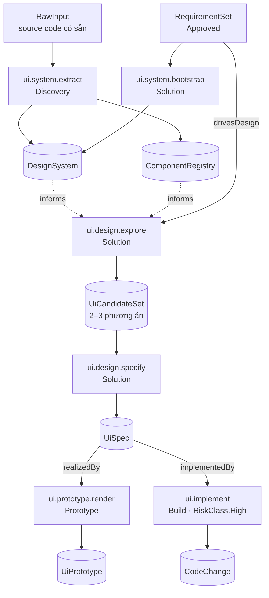
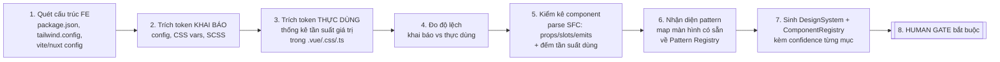

# 07 — UI/UX Design Capability & UI Eval

> **Trạng thái:** `v0.2 — DRAFT` · Lớp 1 UI Eval **đã chạy thật** trên một sản phẩm; phần còn lại là spec.
> Bổ sung cho [02 — Capability & Artifact](02-capability-and-artifact.md) và [03 — Eval & Autonomy](03-eval-and-autonomy.md). Mọi bất biến ở hai file đó **vẫn giữ nguyên**; file này chỉ thêm capability, artifact type và eval profile.
>
> **v0.2 — 2026-08-11.** v0.1 viết cho **một** sản phẩm. v0.2 mở sang **nhiều sản phẩm, mỗi khách một phong cách**, và gộp bài học từ 6 màn đã đi trọn vòng Stitch → Vue → eval. Bốn thay đổi lớn:
>
> | | Mục mới | Giải quyết |
> |---|---|---|
> | 1 | [§2b — Kiến trúc ba tầng](#2b-kiến-trúc-ba-tầng--lõi--profile--sản-phẩm) | Nhiều khách, mỗi khách một phong cách, mà vẫn dùng chung một bộ eval |
> | 2 | [§5b — Tách knowledge: lõi ↔ profile](#5b-tách-knowledgeui-thành-lõi-và-profile-theo-loại-app) | Quy tắc công cụ nội bộ **sai** với sản phẩm hướng người dùng cuối |
> | 3 | [§10b — Vòng 0 + bước chuẩn hoá](#10b-vòng-0--chốt-ngôn-ngữ-thị-giác-trước-khi-thiết-kế-màn-nào) | Stitch sinh không tất định → ngôn ngữ thị giác trôi giữa các màn |
> | 4 | [§11b — Luồng đầy đủ, eval hai lần](#11b-luồng-đầy-đủ-v02--nơi-mỗi-bước-nằm) | Lỗi thiết kế lẽ ra bắt được trước khi tốn một vòng convert |
>
> **Số mục cũ giữ nguyên** — nhiều file khác trỏ tới `§4`, `§5`, `§8`, `§9`, `§10`, `§11`, `§12`. Mục mới mang hậu tố chữ. Lý do từng thay đổi ở [§17](#17-lịch-sử-thay-đổi).

## 1. Vì sao cần — và bằng chứng

Vấn đề: **AI thiết kế giao diện từ prompt trần thì không ổn định.** Cùng một yêu cầu, hai lần chạy ra hai hệ thống thị giác khác nhau; không có gì để so "đúng/sai" ngoài cảm tính người xem; và không có cách nào bắt AI dùng lại thứ dự án đã có.

Phiên làm việc dựng prototype cho `projects/jira-issue-templates` là ca bệnh điển hình, hỏng đúng ba nhịp:

| Nhịp | Chuyện gì xảy ra | Thiếu cái gì |
|---|---|---|
| 1 | AI tự chọn phong cách thị giác rồi dựng luôn 9 màn hình | Không có `DesignSystem` để bám → buộc phải tự phát minh |
| 2 | Người dùng phải chỉ ra "sao không hỏi phong cách" | Không có **gate chốt hướng thiết kế** trước khi dựng |
| 3 | Dựng lại theo Material 3, vẫn "chưa ưng ý"; rà lại còn lòi 2 lỗi (`display` ghi đè, đổi dự án không re-render) | Không có **UI Eval** — không ai chấm trước khi giao |

Ba nhịp này ánh xạ đúng ba thứ file này định nghĩa: **Design System (artifact)**, **Design Direction gate**, **UI Eval**.

## 2. Phân tích quyết định gốc — giữ gì, chỉnh gì

### Bốn điểm đúng, giữ nguyên

1. **Capability-first, không dựng `Designer Agent`.** Khớp NT1 và bất biến "Capability khai báo, không mô tả cách thực thi" ([02 §6](02-capability-and-artifact.md)). Model mạnh lên thì đổi `ExecutionBinding`, contract không đổi.
2. **Eval là cổng chặn, không coi UI do AI sinh là đúng ngay.** Khớp luận điểm Eval-là-moat ([03 §1](03-eval-and-autonomy.md)).
3. **Thư viện ngoài chỉ là nguồn capability.** Đúng — nhưng cần cơ chế cụ thể để "chỉ là nguồn" không trôi thành "phụ thuộc cứng" (§9).
4. **Knowledge tách khỏi Capability.** Khớp [04](04-knowledge-and-orchestration.md).

### Năm điểm cần chỉnh

**(a) `UI/UX Design Capability` là một cục quá to — phải tách.**
Bảy trách nhiệm bạn liệt kê có input/output khác hẳn nhau: *học UI dự án có sẵn* (đọc source → tri thức), *thiết kế* (yêu cầu → đặc tả), *dựng prototype* (đặc tả → HTML), *chuyển cho Frontend* (đặc tả → code). Một `CapabilityDefinition` chỉ khai được **đúng một** `OutputContract.Produces` ([02 §1](02-capability-and-artifact.md)) — gộp lại thì không khai nổi. Tách thành 6 capability ở §4.

**(b) Design System phải là Artifact, không chỉ là Knowledge.**
Bạn xếp `design-system/` cạnh `knowledge/ui/`. Nhưng Design System của một dự án là **thứ do capability sinh ra** (trích từ source, hoặc bootstrap từ yêu cầu) — mà bất biến #3 nói *"không có output trôi nổi; mọi sản phẩm là Artifact có type, provenance, cạnh truy vết"*. Nếu Design System chỉ là file knowledge thì nó không có version, không truy được "màu này từ đâu ra, ai duyệt", và không đo được compliance.

> **Chốt:** `DesignSystem` là **Artifact** (có version, provenance, edges). Sau khi được duyệt, nó **được publish thêm** vào Knowledge Store để RAG truy xuất. Hai vai, không mâu thuẫn — đúng luồng "project → chắt lọc → org" ở [04 §1](04-knowledge-and-orchestration.md).

**(c) 10 tiêu chí UI Eval đang trộn hai loại rất khác nhau.**
`Design-system compliance`, `Accessibility`, `Responsive`, `Reuse component` **đo được bằng máy, chi phí ~0**. `Visual hierarchy`, `Information density`, `Task efficiency` **cần phán đoán**. Trộn chung rồi lấy một điểm trung bình sẽ tạo ra con số vô nghĩa: một thiết kế vi phạm contrast (lỗi cứng, không thương lượng) vẫn có thể đạt 0.8 nhờ các mục khác cao.

> **Chốt:** chia hai lớp theo đúng thang 4 tầng ở [03 §2](03-eval-and-autonomy.md). Lớp deterministic là **blocking, pass/fail, không tính điểm**. Lớp judge là **scoring**. Chi tiết §8.

**(d) Thiếu một gate mà chính phiên này chứng minh là bắt buộc: chốt hướng thiết kế.**
Khi dự án **chưa có** Design System, AI vẫn phải chọn phong cách — và đó là quyết định thuộc thẩm quyền người dùng (thẩm mỹ, thương hiệu), không phải thẩm quyền kỹ thuật. Không có gate này thì vòng lặp "AI dựng → người không ưng → dựng lại" tái diễn mãi, và mỗi vòng tốn cả bộ màn hình.

> **Chốt:** thêm **Design Direction gate** loại `PreRun` ([04 §6](04-knowledge-and-orchestration.md)), bắt buộc khi `DesignSystem` chưa tồn tại hoặc chưa `Approved`.

**(e) `Empty State`, `Error State`, `Loading State` không phải pattern ngang hàng với `CRUD List`.**
Chúng là **trạng thái bắt buộc bên trong** một pattern, không phải trang riêng. Xếp ngang hàng thì AI sẽ coi chúng là tùy chọn và bỏ qua — đúng như prototype Jira ban đầu chỉ có happy path.

> **Chốt:** mỗi pattern khai `requiredStates[]`; UI Eval có check `PAT-01` bắt buộc đủ state. Chi tiết §7.

---

## 2b. Kiến trúc ba tầng — lõi · profile · sản phẩm

*Thêm ở v0.2.* v0.1 giả định **một** bộ quy tắc cho mọi giao diện. Giả định đó vỡ ngay khi có hai điều kiện thật:

1. **Mỗi khách hàng một phong cách.** Bảng màu, bo góc, font là thứ khách quyết, không phải ta.
2. **Có cả sản phẩm hướng người dùng cuối.** Với loại đó, nhiều quy tắc hiện có **sai chứ không phải chặt** — `PRIN-02` (*mật độ là tính năng*) đảo ngược hoàn toàn.

Nhưng không được đi tới thái cực kia: bỏ quy tắc **không** làm AI sáng tạo hơn, nó làm judge **mất từ vựng**. [knowledge/ui/README](../knowledge/ui/README.md) bắt judge trích dẫn mã khi trừ điểm, cấm chấm *"trông chưa ổn"*. Không còn mã thì không còn cách bảo AI **sửa cái gì**.

Lời giải là ba tầng, phân theo **ai có quyền đổi**:

```text
╔═ TẦNG 1 · LÕI ═══════════════════════════ không ai override được ═╗
║  design-system/invariants.json    máy đọc, eval cưỡng chế         ║
║  knowledge/ui/core/               quy tắc đúng với MỌI loại app   ║
╚═══════════════════════════════════════════════════════════════════╝
                    ▼  kế thừa
╔═ TẦNG 2 · PROFILE THEO LOẠI APP ═══ chọn 1, không tự chế ════════╗
║  knowledge/ui/profiles/cong-cu-noi-bo/                            ║
║  knowledge/ui/profiles/nguoi-dung-cuoi/                           ║
║  → mật độ · trang trí · chuyển động · và PRIN-08 bản riêng        ║
╚═══════════════════════════════════════════════════════════════════╝
                    ▼  kế thừa
╔═ TẦNG 3 · SẢN PHẨM · repo khách hàng ═══ khách quyết hình thức ══╗
║  ui/CONTEXT.md              khai `appType` → chọn profile         ║
║  ui/design-direction.md     kết quả Design Direction gate         ║
║  ui/design-overrides.json   extends: org@x.y · mỗi mục có $reason ║
╚═══════════════════════════════════════════════════════════════════╝
```

### Ranh giới: ép **cách vận hành**, thả **hình thức**

*Chốt 2026-08-11.* Người dùng nhận ra công ty qua **cách dùng** nhiều hơn qua màu sắc.

| ÉP — tầng 1, không thương lượng | THẢ — tầng 3, khách quyết |
|---|---|
| Thang spacing gốc 4px | Bảng màu và màu seed |
| Sàn WCAG 2.2 AA, kiểm **cả hai** theme | Bo góc |
| Không hard-code giá trị thị giác (`DS-01`) | Font và thang chữ |
| Theme parity (`DS-02`) | Độ nổi / bóng |
| `requiredStates` theo pattern (`PAT-01`) | Hình thức component |
| Mật độ **theo profile** (không tự chế) | Chuyển động (trong trần của profile) |

### `invariants.json` — biến ranh giới trên thành thứ máy cưỡng chế

Trước v0.2, ranh giới này chỉ là **một bảng trong README**. Với một sản phẩm thì kỷ luật con người đủ; với N sản phẩm thì không — một dự án hạ sàn a11y trong config riêng của nó là không ai biết.

```jsonc
// design-system/invariants.json — TẦNG 1, sản phẩm KHÔNG override được
{
  "spacingBase": 4,
  "a11y": { "wcag": "2.2-AA", "checkBothThemes": true },
  "forbidHardcodedVisualValues": true,          // DS-01
  "themeParity": true,                          // DS-02
  "requiredStatesByPattern": true,              // PAT-01
  "densityByAppType": {
    "cong-cu-noi-bo": "compact",
    "nguoi-dung-cuoi": "comfortable"
  }
}
```

> **Bất biến kèm theo:** `ui-eval.config.json` của sản phẩm **chỉ được khai URL và luồng**. Mọi **ngưỡng** đến từ tầng 1 + profile. Sản phẩm khai ngưỡng là lỗi cấu hình, máy bắt được.

### `appType` chọn profile, nhưng không chọc được vào tầng 1

Một sản phẩm khai `appType: nguoi-dung-cuoi` được thả gradient, animation, mật độ thoáng — **vẫn** phải qua `A11Y-01` ở cả hai theme, vẫn không được hard-code màu, vẫn phải đủ `requiredStates`.

### Phiên bản giữa các tầng

`design-overrides.json` đã có `extends: "org@0.1"`. v0.2 bổ sung: eval **cảnh báo** (không chặn) khi bản org mà sản phẩm ghim đã lạc hậu ≥ 1 minor. Chặn cứng sẽ làm mọi sản phẩm đang chạy đỏ mỗi lần org đổi — không đáng.

---

## 3. Ranh giới capability (boundaries)

| Nhóm UI/UX capability **CHỊU TRÁCH NHIỆM** | **KHÔNG** chịu trách nhiệm |
|---|---|
| Hiểu workflow người dùng từ `RequirementSet` | Sinh/sửa `RequirementSet` (việc của `requirement.*`) |
| Xác định information hierarchy, chọn pattern | Quyết định nghiệp vụ (việc của con người/BA) |
| Tìm & tái dùng component trước khi tạo mới | Quyết định tech stack FE (việc của `architecture.*`) |
| Đề xuất 2–3 phương án layout + trade-off | Chọn phương án cuối khi có tranh chấp (việc của gate) |
| Sinh `UiSpec` đủ để implement được | Viết code production (việc của `ui.implement`, stage Build) |
| Trích Design System từ source có sẵn | Refactor source cho hợp Design System (capability riêng, `RiskClass.High`) |
| Chấm `UiSpec`/`UiPrototype` theo UI Eval | Tự nâng ngưỡng eval của chính mình |

**Ranh giới cứng:** nhóm này **chỉ đọc** source code, **không ghi**. Việc ghi vào source thuộc `ui.implement` — `RiskClass.High`, **luôn gate** ([03 §6](03-eval-and-autonomy.md)).

---

## 4. Phân rã capability



| CapabilityId | Stage | Input `requires` | Input `optional` | `Produces` | Risk | Autonomy mặc định |
|---|---|---|---|---|---|---|
| `ui.system.extract` | Discovery | `RawInput` (source) | — | `DesignSystem` + `ComponentRegistry` | Low (chỉ đọc) | L2 |
| `ui.system.bootstrap` | Solution | `RequirementSet` | `DesignSystem` (org) | `DesignSystem` | Low | **L2 + PreRun gate** |
| `ui.design.explore` | Solution | `RequirementSet`, `DesignSystem` | `ComponentRegistry`, `CustomerFeedback` | `UiCandidateSet` | Low | L2 |
| `ui.design.specify` | Solution | `UiCandidateSet` | `DesignSystem` | `UiSpec` | Low | L2 → L3 khi tốt nghiệp |
| `ui.prototype.render` | Prototype | `UiSpec`, `DesignSystem` | — | `UiPrototype` | Low | L2 → L3 |
| `ui.implement` | Build | `UiSpec`, `DesignSystem`, `ComponentRegistry` | — | `CodeChange` | **High** | **luôn gate** |

> **`ui.design.explore` chỉ chạy khi cần.** Precondition: yêu cầu có ≥1 màn hình chưa map được về pattern quen thuộc, **hoặc** người dùng yêu cầu tường minh. Màn hình CRUD chuẩn thì đi thẳng `specify` — không đốt token để "sáng tạo" thứ đã có lời giải.

### UI Eval **không** phải capability

Bạn xếp `UI Eval` như một hộp trong luồng. Về kiến trúc nó là **`EvalSpec` chuyên biệt gắn vào `ui.design.specify` và `ui.prototype.render`**, chạy bởi Eval Engine sẵn có, sinh `EvalResult` — không sinh artifact mới, không phải capability. Giữ như vậy thì Autonomy Controller, golden data và dashboard eval ([03 §3–5](03-eval-and-autonomy.md)) dùng lại được nguyên vẹn, không phải viết đường ống thứ hai.

### Artifact type bổ sung vào catalogue [02 §3](02-capability-and-artifact.md)

| ArtifactType | Stage | Nội dung chính |
|---|---|---|
| `DesignSystem` | Discovery / Solution | tokens + rules + theme; có `Source` = `Extracted` \| `Bootstrapped` \| `Imported` |
| `ComponentRegistry` | Discovery | danh mục component dùng được: API, trạng thái, nguồn, độ tin cậy |
| `UiCandidateSet` | Solution | 2–n phương án layout/pattern kèm trade-off và khuyến nghị |
| `UiSpec` | Solution | đặc tả từng màn: pattern, vùng, component, token, state, a11y, responsive, luồng |

`UiPrototype` đã có sẵn trong catalogue — giữ nguyên, nhưng **nay sinh ra từ `UiSpec`, không sinh thẳng từ `RequirementSet`**. Đây là thay đổi luồng quan trọng nhất ở §10.

**Cạnh truy vết:** dùng lại nguyên bộ edge có sẵn — `RequirementSet --drivesDesign--> UiSpec`, `DesignSystem --informs--> UiSpec`, `UiSpec --realizedBy--> UiPrototype`, `UiSpec --implementedBy--> CodeChange`. Không cần loại cạnh mới.

> `💡` Cân nhắc thêm một loại cạnh `conformsTo` (`UiSpec --conformsTo--> DesignSystem`) nếu muốn truy vấn compliance trực tiếp trên đồ thị thay vì đọc trong nội dung artifact. Không bắt buộc cho v1.

### Ví dụ `CapabilityDefinition` — `ui.design.specify`

```jsonc
{
  "id": "ui.design.specify",
  "displayName": "Đặc tả giao diện",
  "stage": "Solution",
  "input": {
    "requires": ["UiCandidateSet"],
    "optional": ["DesignSystem", "ComponentRegistry", "CustomerFeedback"],
    "preconditions": [
      "RequirementSet.status == Approved",
      "DesignSystem.status == Approved"        // chưa Approved → Orchestrator chạy bootstrap + gate trước
    ]
  },
  "output": { "produces": "UiSpec", "schema": "schemas/ui-spec.schema.json" },
  "knowledgeRefs": [
    { "scope": "org",     "tag": "ui-principles" },
    { "scope": "org",     "tag": "ui-patterns" },
    { "scope": "org",     "tag": "ui-anti-patterns" },
    { "scope": "project", "tag": "existing-ui-conventions" }
  ],
  "budget": { "maxTokens": 180000, "maxUsd": 2.5, "maxSeconds": 300 },
  "eval": {
    "profile": "ui-eval.v1",                   // xem §8
    "judge": { "tier": "Deep", "passThreshold": 0.75 },
    "humanGate": "conditional"                 // điều kiện ở §11
  },
  "risk": "Low",
  "defaultAutonomy": "Supervised",
  "execution": { "kind": "SinglePrompt", "adapterKey": "prompt.ui-specify.v1" }
}
```

---

## 5. UI Knowledge structure

Hai kho tách bạch theo **ai sở hữu và tốc độ đổi**:

```text
knowledge/ui/                    ← Org scope · người sở hữu · đổi chậm · KHÔNG do AI ghi
├── README.md                    chỉ mục, quy ước viết quy tắc, giả định đang dùng
├── design-principles.md   PRIN  7 nguyên tắc + PRIN-08 thứ tự thắng khi xung đột
├── visual-language.md     VIS   dùng thang chữ và vai trò màu thế nào
├── layout-and-density.md  LAY   bố cục, mật độ, căn chỉnh, nhịp khoảng cách
├── form-guidelines.md     FORM  nhãn, điều khiển, validate, giá trị mặc định
├── table-guidelines.md    TBL   cột, hàng, hành động, lọc, bảng rộng
├── state-guidelines.md    STATE 6 trạng thái + ma trận bắt buộc theo pattern
├── accessibility.md       A11Y  WCAG 2.2 AA + §Điểm mù của check tự động
├── responsive-rules.md    RES   breakpoint + thứ tự hy sinh khi thu hẹp
├── microcopy-vi.md        COPY  chữ giao diện tiếng Việt
└── anti-patterns.md       AP    danh sách CẤM — căn cứ để Eval trừ điểm

design-system/                   ← Artifact `DesignSystem`, có version · AI sinh, người duyệt
├── tokens/                      color · typography · spacing · radius · elevation · motion · z-index
├── themes/                   ★  light.json · dark.json (mọi token phải có đủ 2 giá trị)
├── components/                  <name>/component.json + usage.md + examples/
└── patterns/                    <pattern>/pattern.json + when-to-use.md + skeleton
```

**`knowledge/ui/` đã viết xong v0.1** (2026-08-10). Ba quyết định cấu trúc khi triển khai thật, khác bản phác ở trên:

- **Gộp `typography.md` + `color-system.md` + `spacing-system.md`** thành `visual-language.md` và `layout-and-density.md`. Ba file gốc sẽ chép lại giá trị đã có trong token → hai nguồn sự thật. Knowledge chỉ nói *dùng cấp nào ở đâu*; token nói *cấp đó bằng bao nhiêu*.
- **Mọi quy tắc có mã** (`LAY-04`, `AP-11`…). Judge lớp 2 **bắt buộc trích dẫn mã** khi trừ điểm; cấm chấm "trông chưa ổn". Quy tắc nào không trích dẫn được trong một lần chấm thật thì quy tắc đó viết chưa đủ cụ thể — sửa quy tắc, đừng để judge tự diễn giải.
- **`anti-patterns.md` ưu tiên quy tắc rút từ lỗi thật** (đánh dấu 🔬, có ảnh chứng minh) hơn quy tắc chép từ sách. 9/18 mục hiện tại đến từ [báo cáo eval prototype v4](../projects/jira-issue-templates/02-prototype/ui-eval-report.md).

★ = **tôi đề xuất thêm**, không có trong bản gốc của bạn. Lý do:

- **`anti-patterns.md`** — Eval cần *danh sách phủ định*. "Làm cho tốt" không chấm được; "không được đặt hành động chính trong menu ba chấm" thì chấm được.
- **`microcopy-vi.md`** — sản phẩm này giao diện tiếng Việt. Chữ trên nút/nhãn/thông báo lỗi là phần AI sai nhiều nhất mà không có chuẩn nào bắt.
- **`state-guidelines.md`** — tách riêng vì đây là gốc của chỉnh sửa (e) ở §2.
- **`themes/`** — phiên này vừa chứng minh: thêm chế độ tối sau khi đã dựng xong là phải rà lại toàn bộ màu. Token phải có đủ giá trị cả hai theme **ngay từ đầu**.

### Định dạng token

`⚠️ OPEN DECISION` — đề xuất **W3C Design Tokens Community Group format** (`$type` / `$value`):

```jsonc
// design-system/tokens/color.json
{
  "$schema": "https://tr.designtokens.org/format/",
  "color": {
    "surface":      { "$type": "color", "$value": { "light": "#FEF7FF", "dark": "#000000" } },
    "on-surface":   { "$type": "color", "$value": { "light": "#1D1B20", "dark": "#EAE6EF" } },
    "primary":      { "$type": "color", "$value": { "light": "#6750A4", "dark": "#D0BCFF" },
                      "$description": "Hành động chính. Không dùng cho trang trí." }
  }
}
```

Vì sao không dùng thẳng `tailwind.config.js` làm nguồn sự thật: token cần **xuất được ra nhiều đích** (CSS variables cho prototype HTML tự chứa, Tailwind config cho app thật, JSON cho Figma, và bảng tra cho Eval kiểm compliance). Một định dạng trung lập ở giữa, sinh ra các đích — không phải ngược lại.

---

## 5b. Tách `knowledge/ui` thành lõi và profile theo loại app

*Thêm ở v0.2.* Rà lại toàn bộ **20 anti-pattern + 8 nguyên tắc** hiện có và phân loại theo một câu hỏi duy nhất:

> *Quy tắc này còn đúng khi sản phẩm hướng tới người dùng cuối không?*

Kết quả đáng chú ý: **những quy tắc bó sáng tạo gần như trùng khít với những quy tắc đã tự khai phạm vi "công cụ nội bộ".** Phần còn lại không bó sáng tạo — nó bắt lỗi.

### Chuyển xuống profile — 7 anti-pattern + 2 nguyên tắc

| Mã | Nội dung | Vì sao thả được cho người dùng cuối |
|---|---|---|
| `PRIN-02` | Mật độ là tính năng · nội dung ≥ 60% chiều cao | **Đảo ngược** với sản phẩm hướng người dùng cuối — khoảng thở là giá trị |
| `PRIN-07` | Trang trí phải trả tiền chỗ nó chiếm | Cha của `AP-06`. Với loại này, cảm xúc **là** giá trị |
| `AP-04` | Màn hình rỗng đáy < 60% | Hệ quả trực tiếp của `PRIN-02` |
| `AP-06` | Hiệu ứng không giải thích được | Phép thử *"bỏ đi thì mất thông tin gì"* thuần vị lợi — cấm mọi thứ dễ chịu |
| `AP-07` | Thẻ lồng thẻ quá 2 tầng | Bề mặt lồng nhau là chuẩn mực của giao diện người dùng cuối |
| `AP-09` | Cấm gradient | Rule **đã tự khai** phạm vi *"trong công cụ nội bộ"* ngay ở tên |
| `AP-10` | Cấm animation trang trí, > 300ms | Lý lẽ *"thuế thu hằng ngày"* chỉ đúng với công cụ mở vài chục lần/ngày |
| `AP-02` | Mép phải răng cưa | Khối tràn viền xen khối hẹp là thủ pháp bố cục hợp lệ |
| `AP-13` | Chữ < 12.5px | **Giữ luật, đổi con số** — người dùng cuối thường cần chữ **to hơn** |

### Ở lại lõi — 13 anti-pattern + 6 nguyên tắc

| Nhóm | Mã | Vì sao không thả |
|---|---|---|
| **A11y — không thương lượng** | `AP-08` `AP-11` `AP-12` `AP-20` `PRIN-03` | `AP-11` là ca **check tự động báo PASS trong khi chữ không đọc nổi**. Thả nó là thả đúng chỗ máy đang mù |
| **Nói dối trạng thái** | `AP-03` `AP-15` `AP-16` `PRIN-05` `PRIN-06` | Trang đẹp mà nút không trông như nút, hoặc lỗi không có lối thoát, thì vẫn hỏng — và hỏng đắt hơn |
| **Bố cục vỡ** | `AP-05` `AP-19` | Thanh bên đẩy khối tài khoản khỏi màn không phải phong cách, là lỗi. Máy kiểm được (`RES-12`) |
| **Dữ liệu** | `AP-14` `AP-18` | Cột số căn trái thì không so sánh được, ở đâu cũng vậy |
| **Nội dung & cấu trúc** | `AP-17` `PRIN-01` `PRIN-04` | Giấu hành động chính trong menu `…` không phải sáng tạo |

**Tỉ lệ: 7/20 xuống profile, 13/20 ở lại lõi.**

### `PRIN-08` — chỗ thật sự cởi trói, và là thứ PHẢI có bản riêng mỗi profile

`PRIN-08` là **trọng tài**: nó quyết ai thắng khi hai nguyên tắc va nhau, và judge bắt buộc nêu đã áp bậc nào khi trừ điểm. Đổi đúng bảng này mở khoá gần hết phần sáng tạo **mà không xoá một quy tắc nào**.

```text
cong-cu-noi-bo (bản hiện có)      nguoi-dung-cuoi (viết mới)
1. Khả năng tiếp cận              1. Khả năng tiếp cận        ← vẫn số 1
2. Tính đúng đắn dữ liệu          2. Tính đúng đắn dữ liệu    ← vẫn số 2
3. Hiệu quả tác vụ chính          3. ★ Thẩm mỹ & cảm nhận thương hiệu
4. Nhất quán với phần đã có       4. Hiệu quả tác vụ chính
5. Mật độ thông tin               5. Nhất quán với phần đã có
6. Thẩm mỹ              ← đáy     6. Mật độ thông tin          ← đáy
```

Nâng thẩm mỹ lên bậc 3 nghĩa là judge **không được** trừ điểm thẩm mỹ để đổi lấy mật độ nữa. Hai bậc đầu **không đổi ở bất kỳ profile nào** — đó là ranh giới giữa "phong cách" và "lỗi".

### Cấu trúc thư mục sau khi tách

```text
knowledge/ui/
├── README.md                     chỉ mục · quy ước viết quy tắc · cách chọn profile
├── core/                         ★ đúng với MỌI loại app
│   ├── design-principles.md      PRIN-01/03/04/05/06 + PRIN-08 (khung, không có thứ tự)
│   ├── visual-language.md        VIS — dùng thang chữ và VAI TRÒ màu thế nào
│   ├── accessibility.md          A11Y — nguyên vẹn
│   ├── state-guidelines.md       STATE — nguyên vẹn
│   ├── form-guidelines.md        FORM
│   ├── table-guidelines.md       TBL
│   ├── microcopy-vi.md           COPY
│   ├── responsive-rules.md       RES
│   └── anti-patterns.md          13 mã ở lại
└── profiles/
    ├── cong-cu-noi-bo/           ★ nội dung hiện tại, chuyển xuống
    │   ├── PRIN-08.md            thứ tự thắng — bản công cụ nội bộ
    │   ├── density.md            PRIN-02 · AP-04 · LAY-11 compact
    │   └── anti-patterns.md      AP-02 · AP-06 · AP-07 · AP-09 · AP-10 · ngưỡng AP-13
    └── nguoi-dung-cuoi/          ★ CHƯA CÓ — viết mỏng trước
        ├── PRIN-08.md            thứ tự thắng — bản người dùng cuối
        ├── density.md            mật độ thoáng, nhịp bố cục
        ├── motion.md             thay AP-10: tôn trọng `prefers-reduced-motion`,
        │                         không chặn tương tác, có trần hiệu năng
        └── surfaces.md           thay AP-09: gradient được dùng, NHƯNG chữ trên
                                  gradient phải đạt tương phản ở **điểm xấu nhất**
                                  của bề mặt, không phải điểm trung bình
```

> **`visual-language.md` và `layout-and-density.md` bị tách đôi** khi chuyển: phần *dùng thang chữ và vai trò màu thế nào* thuộc lõi; phần *mật độ, nhịp khoảng cách* thuộc profile.

### Viết `nguoi-dung-cuoi/` mỏng trước, dày theo sản phẩm thật

Quy ước số 5 của `knowledge/ui` là **"ưu tiên quy tắc rút từ lỗi thật hơn quy tắc chép từ sách"** — và 9/18 mục anti-pattern hiện có đến từ lỗi thật.

Viết dày profile người dùng cuối **ngay bây giờ, khi chưa có sản phẩm loại đó**, chính là chép sách. Nên v0.2 chốt:

| Làm ngay | Hoãn tới sản phẩm người dùng cuối đầu tiên |
|---|---|
| Tách `core/` ↔ `profiles/cong-cu-noi-bo/` (cơ học) | Quy tắc chi tiết về nhịp bố cục, thang chữ lớn |
| Viết `PRIN-08` bản người dùng cuối (một bảng) | Danh sách anti-pattern riêng của loại này |
| Viết `motion.md` + `surfaces.md` ở mức **giữ hệ quả a11y** | Phần thẩm mỹ — chờ có lỗi thật để rút |

---

## 6. Component Registry

Mục đích: để capability **tìm được thứ đã có trước khi phát minh thứ mới**. Không có registry thì "reuse component" là khẩu hiệu không đo được.

```jsonc
{
  "id": "ui.component.data-table",
  "name": "DataTable",
  "status": "Approved",              // Approved | Candidate | Deprecated
  "framework": "vue3",
  "source": {
    "kind": "Project",               // Project | Org | Vendor
    "vendor": "shadcn-vue",          // nếu có gốc từ ngoài
    "vendorVersion": "0.x",
    "license": "MIT",
    "wrapper": "src/components/ui/DataTable.vue"   // BẮT BUỘC nếu kind=Vendor — xem §9
  },
  "api": {
    "props":  [{ "name": "rows", "type": "T[]", "required": true }],
    "slots":  [{ "name": "empty", "purpose": "trạng thái rỗng" }],
    "events": [{ "name": "sort",  "payload": "{ key, dir }" }]
  },
  "tokensUsed": ["color.surface", "color.outline-variant", "spacing.md"],
  "a11y": { "wcag": "2.2-AA", "keyboard": true, "notes": "hàng điều hướng bằng phím mũi tên" },
  "patterns": ["pattern.crud-list", "pattern.master-detail"],
  "states": ["empty", "loading", "error"],
  "replaces": ["ui.component.legacy-grid"],
  "usage": { "occurrences": 14, "screens": ["ProjectList", "IssueHistory"] },
  "provenance": { "discoveredBy": "run:8f2a…", "confidence": 0.92, "verifiedBy": "human:anh.phamviet" }
}
```

Ba trường làm nên giá trị của registry:

- **`status`** — `Candidate` là thứ AI tìm thấy nhưng người chưa duyệt. Capability **được đọc** `Candidate` nhưng dùng nó thì **buộc phải gate** (§11).
- **`api`** — không có API thì AI không dùng lại được, chỉ nhìn thấy tên rồi tự viết lại từ đầu.
- **`usage`** — tần suất thật trong code. Đây là căn cứ để trả lời *"giao diện hiện tại của dự án đang theo lối nào"*, và là baseline cho tiêu chí "consistency với UI hiện có".

---

## 7. Pattern Registry

```jsonc
{
  "id": "pattern.crud-list",
  "name": "CRUD List",
  "problem": "Người dùng cần xem, lọc và thao tác trên một tập bản ghi cùng loại.",
  "requirementSignals": ["danh sách", "lọc", "tìm kiếm", "phân trang", "thêm", "sửa", "xoá"],
  "whenToUse":    ["≥ 20 bản ghi", "thao tác lặp lại hằng ngày"],
  "whenNotToUse": ["< 5 bản ghi cố định → dùng pattern.settings", "quan hệ cha-con → pattern.master-detail"],
  "structure": { "regions": ["toolbar", "filters", "list", "pagination", "rowActions"] },
  "requiredStates": ["empty", "loading", "error", "no-permission", "no-result-after-filter"],
  "componentSlots": [
    { "region": "list",    "componentIds": ["ui.component.data-table"] },
    { "region": "filters", "componentIds": ["ui.component.filter-bar"] }
  ],
  "evalRules": [
    "hành động chính phải nhìn thấy được, không nằm trong menu tràn",
    "trạng thái rỗng phải nêu bước tiếp theo, không chỉ nói 'Không có dữ liệu'",
    "lọc không ra kết quả phải phân biệt được với chưa có dữ liệu"
  ],
  "antiPatterns": ["phân trang vô hạn cho dữ liệu cần đối chiếu", "cột hành động không có nhãn"]
}
```

`requirementSignals` chính là cơ chế cho *"chọn UI pattern phù hợp"*: capability so tín hiệu trong `RequirementSet` với các pattern, ra danh sách ứng viên có điểm — thay vì để model tự nghĩ.

### Danh mục pattern v1

**Pattern trang** (danh sách của bạn, đã bỏ 3 mục state ra):
`crud-list` · `detail-page` · `create-edit-form` · `dashboard` · `search-filter` · `wizard` · `settings` · `master-detail`

**Bổ sung đề xuất** — đều là thứ prototype Jira đã đụng và làm sai:
`bulk-action` · `destructive-confirm` · `read-only-permission` (vào xem được nhưng không sửa, kèm giải thích) · `first-run-setup` (chưa cấu hình xong thì dẫn đi đâu) · `async-result` (thao tác chạy nhiều bước, báo tiến độ và điểm dừng khi hỏng giữa chừng).

**Trạng thái bắt buộc** (không phải pattern — là `requiredStates` bên trong pattern):
`empty` · `loading` · `error` · `no-permission` · `partial-failure` · `no-result-after-filter`

> `partial-failure` là bài học trực tiếp từ Jira: issue tạo xong nhưng chuỗi transition hỏng giữa chừng. Không có state này thì AI chỉ dựng happy path.

---

## 8. UI Eval — tiêu chí & chấm điểm

Profile `ui-eval.v1`, chạy trên `UiSpec` (và lại lần nữa trên `UiPrototype` cho các check chỉ đo được khi đã render).

### Lớp 1 — Deterministic · **blocking** · pass/fail · chi phí ~0

Sai bất kỳ mục nào → **fail ngay, không gọi judge**. Đúng tinh thần "dừng sớm nếu tầng dưới fail" ([03 §2](03-eval-and-autonomy.md)).

| Mã | Check | Cách đo | Ngưỡng |
|---|---|---|---|
| `DS-01` | Token compliance | mọi giá trị màu/spacing/radius/typography đối chiếu bảng token | 100% — **0 giá trị hard-code** |
| `DS-02` | Theme parity | mọi token dùng trong spec có giá trị ở **cả** light và dark | 100% |
| `CMP-01` | Component reuse | % vùng UI ánh xạ được về component trong Registry | ≥ 80% |
| `CMP-02` | Component mới | số component tạo mới ngoài Registry | > 0 → **cưỡng chế gate** (không fail) |
| `A11Y-01` | Tương phản | tính từ cặp token nền/chữ, cả 2 theme | ≥ 4.5:1 (chữ thường) · 3:1 (chữ lớn & UI) |
| `A11Y-02` | Kích thước vùng bấm | từ spec component | ≥ 24×24px (WCAG 2.2 AA) |
| `A11Y-03` | Nhãn ô nhập | mọi input có nhãn liên kết | 100% |
| `A11Y-04` | Focus nhìn thấy được | có khai style focus | 100% |
| `RES-01` | Breakpoint | không tràn ngang ở mọi breakpoint khai báo | 0 lỗi |
| `PAT-01` | Trạng thái bắt buộc | pattern khai `requiredStates` nào thì spec phải có đủ | 100% |
| `TRACE-01` | Truy vết | mọi màn hình map về ≥1 requirement; mọi FR `Must` lên được màn hình | 100% |
| `CONS-01` | Trùng lặp | không có 2 vùng cùng chức năng khai 2 kiểu khác nhau | 0 |

### Lớp 2 — Render → chụp ảnh → **judge chấm trên PIXEL** · scoring 0..1

> **Bổ sung sau review [08](08-ui-capability-gap-review.md) §4.6.** Bản đầu của file này để judge chấm trên `UiSpec` — tức một mô tả **bằng chữ**. Sai. Model đọc chữ mô tả về giao diện không thể đánh giá thứ bậc thị giác, căn chỉnh, mật độ hay "trang trí thừa"; những thứ đó chỉ tồn tại khi đã render ra pixel.

```text
UiSpec ──► render headless ──► screenshot (light + dark, ≥2 breakpoint, mọi màn chính)
                                        │
                                        ▼
                          Judge ĐA PHƯƠNG THỨC chấm trên ẢNH
```

**Đã chứng minh trên thực tế** ([báo cáo](../projects/jira-issue-templates/02-prototype/ui-eval-report.md), harness ở [tools/ui-eval](../../tools/ui-eval/README.md)): chạy trên prototype Jira v4 — bản *đã có* Design System đầy đủ — lớp 1 chỉ bắt được lỗi kỹ thuật, còn **9 lỗi thị giác thì vô hình với nó 9/9**.

Ca đắt nhất: thẻ `opacity:.55` trên nền đen gần như không đọc được, nhưng lớp 1 **báo `A11Y-01` PASS** vì `getComputedStyle().color` không tính `opacity` của phần tử cha. **Deterministic check có điểm mù, và nó im lặng khi mù** — đó là lý do lớp 2 không phải tùy chọn.

Bảng chấm:

| Tiêu chí | Trọng số | Câu hỏi cốt lõi |
|---|---|---|
| Task efficiency | **0.20** | Tác vụ chính mất bao nhiêu bước? So với ràng buộc trong NFR? |
| Visual hierarchy | 0.15 | Thứ quan trọng nhất trên màn có nổi bật nhất không? |
| Consistency với UI hiện có | 0.15 | Có lệch khỏi lối đi của phần đã tồn tại không? |
| Consistency nội bộ | 0.15 | Cùng loại việc có trình bày cùng kiểu ở mọi màn không? |
| Information density | 0.10 | Đủ dày để làm việc nhanh, chưa tới mức khó đọc? |
| Simplicity | 0.10 | Có tầng/bước/lựa chọn nào thừa không? |
| Microcopy | 0.10 | Chữ có nói được người dùng cần làm gì tiếp không? |
| Xử lý ca rìa | 0.05 | Ca hỏng có lối thoát rõ ràng không? |

> **`Task efficiency` đo bán tự động.** `UiSpec` khai `flows[]` với số bước; máy đếm và đối chiếu ràng buộc NFR, judge chỉ đánh giá phần còn lại. Bộ đếm thao tác trong prototype Jira là bản thủ công của đúng cơ chế này.

### Ngưỡng và vòng tự sửa

```
Lớp 1 fail            → FAIL. Trả về danh sách lỗi cụ thể. Không gọi judge (tiết kiệm).
Lớp 1 pass + judge ≥ 0.75  → PASS.  Autonomy Controller quyết định gate hay không (§11).
Lớp 1 pass + 0.60–0.75     → SELF-REPAIR. Tối đa 2 vòng.
Lớp 1 pass + judge < 0.60  → HUMAN GATE bắt buộc. Không tự sửa — điểm thấp thế thường là sai hướng, không phải sai chi tiết.
```

**Chặn vòng lặp tự sửa:** mỗi vòng **phải** giảm số lỗi hoặc tăng điểm; không cải thiện → dừng và gate. Cộng dồn vào `CostActual`, vượt `CostBudget` thì dừng ([03 §7](03-eval-and-autonomy.md)).

`⚠️ OPEN DECISION` — ba con số `0.75 / 0.60 / 2 vòng` là điểm khởi đầu có căn cứ, cần hiệu chỉnh bằng golden data sau ~20 lần chạy thật ([03 §3](03-eval-and-autonomy.md)).

---

## 8b. Eval chạy HAI lần · ngưỡng theo tầng · `DS-03`

*Thêm ở v0.2.*

### Hai lần, không phải một

v0.1 (và mọi sơ đồ trước đó) đặt UI Eval **một lần, ở cuối**. Sai về kinh tế: lỗi bắt được ở khâu thiết kế rẻ hơn hẳn lỗi bắt được sau khi đã convert.

| Lần | Chạy trên | Bắt được gì | Bằng chứng |
|---|---|---|---|
| **1** | Bản thiết kế đã chuẩn hoá (HTML từ Stitch) | Tương phản, `opacity` giấu hành động, cột bị cắt, chuỗi bị viết cụt | Riêng màn S3: **6 lỗi tương phản + 4 biểu tượng vô hình + 1 cột bị cắt** — sửa xong trước khi tốn một vòng convert |
| **2** | App thật đang chạy | `CMP-01`, luồng (đếm số lần bấm THẬT), `RES-01b`, và mọi thứ chỉ lộ khi có hành vi | `NFR-07` từng được đếm tay ra "2 lần bấm, đạt" — máy bấm thật thì lộ ra **không tới đích** |

Lần 1 dùng `capture.mjs` (HTML tự chứa), lần 2 dùng `measure.mjs` (app đang chạy). Hai bộ **phải chia sẻ cùng bảng ngưỡng** — đó là lý do ngưỡng thuộc tầng 1, không thuộc file config của sản phẩm.

### Ngưỡng đến từ tầng nào

```text
invariants.json (tầng 1)     →  A11Y-01/02/03/04 · DS-01 · DS-02 · PAT-01 · RES-01
profile (tầng 2)             →  mật độ · trần chuyển động · sàn cỡ chữ · trọng số judge
ui-eval.config.json (tầng 3) →  CHỈ danh sách URL và các luồng cần đếm bấm
```

> **Bất biến:** sản phẩm khai ngưỡng trong config của nó là **lỗi cấu hình**, máy bắt được. Nếu không có luật này thì "sàn a11y của org" chỉ là lời khuyên.

Trọng số judge lớp 2 (bảng ở §8) **thuộc profile**: `cong-cu-noi-bo` giữ `Task efficiency 0.20`; `nguoi-dung-cuoi` sẽ nâng trọng số thẩm mỹ — nhất quán với `PRIN-08` bản riêng ở §5b.

### `DS-03` — độ lệch hình dạng · **báo cáo, không chặn**

Sinh ra từ quyết định *"vòng 0 chỉ ghim màu"* (§10b). Vì hình dạng không ghim, cần biết nó trôi bao nhiêu — bằng số, không bằng cảm tính.

| Đo gì | Cách đo |
|---|---|
| Số giá trị **bo góc** khác biệt Stitch phát ra, và bao nhiêu không khớp thang sản phẩm | Quét class + CSS của bản thiết kế thô |
| Tương tự cho **cỡ chữ**, **khoảng cách**, **độ nổi** | " |

Không chặn, vì bước chuẩn hoá đằng nào cũng ánh xạ chúng về thang sản phẩm. Giá trị của nó là **dữ liệu để xét lại quyết định**:

| Sau 2–3 sản phẩm | Kết luận |
|---|---|
| `DS-03` thấp — Stitch tự nhất quán | Ghim màu là đủ. Đóng câu hỏi |
| `DS-03` cao — mỗi màn một thang | Có **số** để quyết ghim thêm bo góc + thang chữ |

---

## 9. Học giao diện của dự án đang phát triển dở — `ui.system.extract`

Đây là capability khó nhất trong nhóm, vì **trích sai thì đầu độc toàn bộ downstream**.



Ba điểm quyết định chất lượng:

**(a) Tách "khai báo" khỏi "thực dùng".** `tailwind.config.js` nói dự án có 12 màu; code thật dùng 47 giá trị màu, trong đó 35 là hard-code. Chỉ đọc config thì ra một Design System đẹp nhưng sai. Chỉ đọc code thì ra một mớ hỗn độn. **Phải có cả hai**, và chính khoảng lệch giữa chúng là thông tin giá trị nhất: nó là **nợ kỹ thuật UI**, đo được, và là baseline cho tiêu chí `Consistency với UI hiện có`.

**(b) Mỗi mục có `confidence` riêng.** Màu xuất hiện 200 lần trong 30 file → confidence cao. Màu xuất hiện 2 lần → có thể là rác, không phải token. Đừng gộp thành một điểm tin cậy chung cho cả artifact.

**(c) Human gate bắt buộc, không tốt nghiệp L3 được.** Người xác nhận: token nào là chuẩn thật, component nào `Approved` / `Deprecated`, chỗ lệch nào là cố ý. `DesignSystem` chưa qua gate thì `ui.design.*` **không đủ điều kiện chạy** (precondition ở §4).

> **Chế độ vận hành theo tình trạng dự án:**
> | Tình trạng | Đường đi |
> |---|---|
> | Có Design System công ty (Figma/repo) | `Imported` → chỉ cần ánh xạ sang định dạng token → gate nhẹ |
> | Có source code, không có DS | `ui.system.extract` → `Extracted` → **gate nặng** |
> | Dự án mới tinh | `ui.system.bootstrap` → `Bootstrapped` → **Design Direction gate** |

---

## 10. Tích hợp shadcn-vue / PrimeVue / 21st.dev mà không phụ thuộc cứng

Ba lớp cách ly. Bỏ lớp nào thì "chỉ là nguồn tham khảo" sẽ trôi thành phụ thuộc cứng trong vài sprint.

### Lớp 0 — Thứ tự ưu tiên: **hình dạng trước, lấp ô sau**

> **Sửa sau review [08](08-ui-capability-gap-review.md) §4.3.** Xếp "pattern" thành một bậc *dưới* component là ngược: pattern quyết định *hình dạng màn hình*, component chỉ *lấp vào ô* mà pattern đã định. Chọn component trước rồi ghép thành màn hình chính là cách sinh ra "excessive cards".

```text
PHA 1 — HÌNH DẠNG · chọn đúng MỘT
  1. Pattern đã dùng trong chính dự án này
  2. Pattern trong Company Pattern Registry
  3. Pattern tham khảo từ ngoài (chỉ lấy BỐ CỤC — xem lớp 3)
  4. Pattern mới                              ← luôn gate

PHA 2 — LẤP Ô · cho từng ô pattern định nghĩa
  1. Component đã có trong dự án
  2. Component Company Design System
  3. shadcn-vue                               ← nền
  4. Reka UI primitive                        ← khi cần HÀNH VI, không cần hình thức
  5. PrimeVue                                 ← chỉ widget thật sự khó, ghi nợ
  6. Vue Bits                                 ← chỉ khi animation là yêu cầu nghiệp vụ
  7. Component mới                            ← luôn gate
```

**Cấm tạo mới nếu đã có pattern/component phù hợp** — và "phù hợp" do Registry trả lời, không do model tự thấy.

### Lớp 1 — Capability không bao giờ biết tên vendor

`ui.design.*` chỉ đọc `ComponentRegistry`. Trong `UiSpec` chỉ có `componentId: "ui.component.data-table"`. Đổi nền tảng component = cập nhật Registry, **`UiSpec` cũ không đổi một chữ**. Đây là cùng một thủ pháp với `IModelProvider` ([05 §2](05-tech-stack-and-data-model.md)): capability nêu *cái gì*, adapter lo *của ai*.

### Lớp 2 — Adapter theo nguồn

```csharp
public interface IComponentSource
{
    string Key { get; }                                     // "shadcn-vue", "primevue", "21st.dev", "project-scan"
    Task<IReadOnlyList<RawComponent>> DiscoverAsync(SourceQuery q, CancellationToken ct);
    Task<ComponentEntry> NormalizeAsync(RawComponent raw, CancellationToken ct);  // → schema §6
}
```

Mọi nguồn chuẩn hoá về **một** schema Registry. Thêm nguồn mới = thêm adapter, không đụng Core.

### Lớp 3 — Chính sách vendoring (quan trọng nhất)

| Kiểu nguồn | Ví dụ | Chính sách |
|---|---|---|
| **Copy-in** | shadcn-vue, 21st.dev | Code vào repo mình → trở thành component **của dự án**. Vào Registry ở `Candidate`, phải **viết lại theo token của mình** mới lên `Approved`. |
| **Dependency thật** | PrimeVue, Vuetify | **Bắt buộc bọc wrapper** trong `src/components/ui/`. Registry **chỉ trỏ tới wrapper**, không bao giờ trỏ thẳng vào lib. |
| **Cảm hứng** | 21st.dev, Dribbble | Không vào Registry. Chỉ được tham chiếu trong `UiCandidateSet` ở phần lý do. |

> **Bất biến:** một component `kind: "Vendor"` **không được** đạt `status: "Approved"` nếu `source.wrapper` trống. Đây là một deterministic check, máy kiểm được, không phụ thuộc kỷ luật con người.
>
> Nhờ wrapper, đổi PrimeVue → shadcn-vue là sửa n file wrapper, không phải sửa toàn bộ màn hình.

Ngoài ra `license` là trường bắt buộc — component không rõ giấy phép không được `Approved`.

### Chính sách riêng cho từng nguồn (chốt sau review [08](08-ui-capability-gap-review.md))

| Nguồn | Vai trò | Ràng buộc |
|---|---|---|
| **shadcn-vue** | Nền component | Copy-in. Bắt buộc **viết lại theo token của mình** mới lên `Approved`. |
| **Reka UI** | Primitive không kiểu dáng | Dùng khi cần **hành vi** (a11y, keyboard, focus trap) mà tự tạo hình thức. Ưu tiên hơn tự viết hành vi từ đầu. |
| **PrimeVue** | Widget enterprise khó | **Ngoại lệ có ghi nợ.** Chỉ cho bảng ảo hoá, tree table, scheduler. Có hệ theming riêng → trộn với Tailwind là hai nguồn sự thật; bắt buộc wrapper + cầu nối token, và ghi vào sổ nợ kỹ thuật. |
| **Shadcn MCP** | Truy cập registry lúc chạy | Giá trị là **chống model bịa API**, không phải làm đẹp. Phải **xác minh hỗ trợ registry Vue** trước khi phụ thuộc (shadcn gốc là React). Nối vào `IComponentSource`, **không** nối thẳng vào capability. |
| **21st.dev** | Cảm hứng bố cục | ⚠️ **Nguồn rủi ro nhất.** Nội dung nghiêng về thẩm mỹ trang giới thiệu — gradient, hero lớn, animation nhiều — đúng bằng danh sách anti-pattern. **Chỉ được lấy bố cục màn hình dày dữ liệu; cấm lấy hiệu ứng thị giác.** Bắt buộc qua bộ lọc `anti-patterns.md` trước khi vào `UiCandidateSet`. |
| **Vue Bits** | Animation đặc biệt | Chỉ khi animation là **yêu cầu nghiệp vụ**, không phải trang trí. Chịu trần 300ms ở `motion.json`. |

### Đã kiểm chứng thực tế — tích hợp shadcn-vue (2026-08-10)

Chạy thật `shadcn-vue init` + `add button table badge select` trên POC Vue. Bốn phát hiện, cả bốn đều đúng như mục §Lớp 3 dự đoán:

| Phát hiện | Chi tiết | Xử lý |
|---|---|---|
| **Mang theo hệ theming riêng** | Sinh khối `:root` / `.dark` với bảng màu oklch riêng, `--radius: 0.625rem`, biến thể dark theo class `.dark` | **Bắt biến của nó dẫn xuất từ token của mình**: `--primary: var(--ds-color-primary)`, `--radius: var(--ds-radius-xs)`… Xoá hẳn khối `.dark` — token đã tự đổi theo `[data-theme]` nên một nguồn sự thật là đủ |
| **Kéo font từ CDN** | Tự thêm `@import url('https://fonts.googleapis.com/…Geist…')` và ghi đè `--font-sans` | Gỡ bỏ. Phá tính chạy offline và ghi đè quyết định font của Design System |
| **Mang quan điểm thị giác riêng** | `Badge` hard-code `rounded-4xl` (viên tròn) — **không lấy từ `--radius`**, nên không thể ép về lozenge vuông kiểu Atlassian bằng token | Phải **sửa component**. Đúng chính sách copy-in: vendor component chỉ lên `Approved` sau khi viết lại theo token của mình |
| **Bảng màu ngữ nghĩa thiếu** | Chỉ có `default`/`secondary`/`destructive`. Không có success/warning | Phủ bằng token của Design System |

> **Kết luận cho chính sách:** copy-in **không** miễn phí. Nó tiết kiệm phần *hành vi và tinh chỉnh*, nhưng phần *quan điểm thị giác* vẫn phải viết lại. Ước lượng đúng: shadcn-vue lo giúp ~70% (cấu trúc, trạng thái, a11y, chi tiết), 30% còn lại là công sức bắt nó nói đúng ngôn ngữ thị giác của mình.

**Thứ tự triển khai:** các nguồn ngoài chỉ nối **sau khi** đã có Pattern Registry và Component Registry. Nối sớm hơn là thêm cách để không nhất quán, không phải thêm chất lượng — xem [08 §4.2](08-ui-capability-gap-review.md).

---

## 10b. Vòng 0 — chốt ngôn ngữ thị giác trước khi thiết kế màn nào

*Thêm ở v0.2.* Đây là thay đổi quy trình quan trọng nhất của bản này.

### Vấn đề: quy trình đang chạy ngược

Với `jira-issue-templates`:

```text
Stitch tự chọn màu ở TỪNG màn  →  6 màn xong  →  ta ĐI NGƯỢC trích ra design-overrides.json
```

`QĐ6` ghi đúng vậy: *"Đã sinh `design-overrides.json` từ dữ liệu thật — so từng vai trò giữa bộ org và bảng màu dự án"* → **18 override ở light, 22 ở dark**, phát hiện **sau khi** mọi màn đã dựng xong.

Với một sản phẩm còn gom lại được bằng tay. Với nhiều khách × nhiều màn thì không — và lý do đã ghi ở `QĐ5`: **Stitch sinh không tất định**, `generate_screen_from_text` **không lưu màn vào project**, nên mỗi màn là một lượt bốc thăm lại ngôn ngữ thị giác.

### Lời giải: một vòng riêng, chạy trước, chốt màu

```text
Design Direction gate  (người · 4 trục ở §12)
        │
        ▼
╔═ VÒNG 0 ═════════════════════════════════════════════════════╗
║  brief PHONG CÁCH — chưa yêu cầu màn nghiệp vụ nào            ║
║        ↓                                                      ║
║  Stitch sinh 1 màn đại diện                                   ║
║        ↓                                                      ║
║  trích token màu thật ra khỏi kết quả                         ║
║        ↓                                                      ║
║  ui/design-overrides.json     ◄── ★ NGƯỜI DUYỆT Ở ĐÂY         ║
║        ↓                                                      ║
║  upload_design_md  →  create_design_system_from_design_md     ║
║                    →  apply_design_system                     ║
║        └── GHIM vào project Stitch của khách này              ║
╚═══════════════════════════════════════════════════════════════╝
        │  từ đây MÀU cố định cho mọi màn
        ▼
   VÒNG 1..N — mỗi màn nghiệp vụ một vòng
```

Cơ chế ghim **đã có sẵn** và đã dò thật trên endpoint: `upload_design_md` · `create_design_system_from_design_md` · `apply_design_system` ([04-design/README](../projects/jira-issue-templates/04-design/README.md)).

File đó từng ghi: *"Chưa làm — cần thử một vòng 'tự do hoàn toàn' trước để biết gu Stitch ra sao, rồi mới quyết có siết lõi hay không."* **Đã thử sáu vòng tự do.** Điều kiện đó thoả.

### Ghim gì — chốt: **chỉ màu**

*Quyết định 2026-08-11.*

| Ghim ở vòng 0 | Thả cho Stitch quyết ở từng màn |
|---|---|
| Bảng màu · màu seed · vai trò ngữ nghĩa · cả hai theme | Bo góc · thang chữ · độ nổi · nhịp bố cục |

Điều này **không mâu thuẫn** với "thả hình thức" (§2b): Stitch vẫn là người chọn bảng màu — chỉ là chọn **một lần** thay vì chọn lại mỗi màn.

Cái giá đã biết và đã có cách bù: hình dạng có thể trôi giữa các màn → **bước chuẩn hoá phải ánh xạ hình dạng**, và `DS-03` (§8b) đo độ trôi để sau này xét lại bằng số.

### Bước chuẩn hoá — phải có tên, phải có máy kiểm

Đề xuất ban đầu để mũi tên `Design Artifact → Frontend Agent` liền mạch. Thực tế 6 vòng cho thấy **luôn có một bước ở giữa**, và nó lặp lại có quy luật:

| Stitch làm sai | Số lần lặp |
|---|---|
| `opacity-0 group-hover` giấu hành động theo dòng (đo ra 1.0:1) | **3** — S5a · S5b · S3 |
| **Viết cụt chuỗi dài ngay trong markup** — đổi dữ liệu âm thầm | **3** — S5a · S2 · S4 |
| Tự mọc nút ở thanh bên dù đã cấm tường minh | **3** — S2 · S4 · S3 |
| `uppercase` cụm quá 3 từ ở tiêu đề cột | 2 |
| Bỏ sót hẳn một yêu cầu (bộ chọn dự án ở S1) | 1 |

Để "Frontend Agent tự xử" nghĩa là mỗi vòng phát hiện lại cùng ba lỗi đó. Nên chuẩn hoá là **một bước có tên, có script**:

```text
bản thiết kế thô
   ├─ 1. quét luật cấm      opacity giấu hành động · uppercase · hex thô · nút cấm
   ├─ 2. đối chiếu dữ liệu  chuỗi trong markup == chuỗi trong brief?  (bắt viết cụt)
   ├─ 3. ánh xạ hình dạng   rounded-[7px] → radius.md · text-[15px] → body-lg
   └─ 4. ghi DS-03          đếm độ lệch, không chặn
        ↓
bản thiết kế đã chuẩn hoá  +  QUYET-DINH.md của sản phẩm
```

[`tools/ui-eval/quet-nguon.mjs`](../tools/ui-eval/README.md) là mầm của bước 1 — nhưng vòng S3 vừa ghi lại rằng regex của nó **trượt biến thể `group-hover/link:`** và phải sửa tay. Đó chính là lý do nó phải là một cổng có tên chứ không phải một thói quen.

### `DesignBrief` — biên dịch, không viết tay

Entry point đưa cho Stitch **không** được là một file markdown người bảo trì. Bằng chứng: `04-design/s1-danh-sach-mau/DESIGN.md` — bản design system Stitch tự xuất — **mâu thuẫn với chính nó** (`QĐ2`): YAML khai `error: #ba1a1a`, văn xuôi khai `#FF5630`; nền sáng `#faf9ff` vs `#F4F5F7`. Phải chốt một luật để gỡ: *"YAML token là chuẩn; văn xuôi chỉ là mô tả ý đồ."*

**Một file văn xuôi mô tả design system là artifact chắc chắn sẽ lệch khỏi token.** Người viết prose, máy đọc JSON, không ai đối chiếu.

```text
invariants.json  +  profile theo appType  +  knowledge (CHỈ mã liên quan loại màn)
                 +  CONTEXT.md  +  token màu đã ghim ở vòng 0
                              ↓  tools/design-brief/
                        DesignBrief          ← dùng MỘT LẦN, không lưu làm nguồn sự thật
```

Vì không ai sửa nó bằng tay, nó không thể lệch. Skill `make-prototype` đã có bản thô của cơ chế này (§Nguồn bắt buộc — nạp knowledge theo loại màn hình).

### Truyền gì cho Stitch, và **không** truyền gì

Rút từ 6 vòng thật:

| Truyền | Không truyền |
|---|---|
| Màn này phục vụ việc gì, **việc chính là gì** | Token JSON — Stitch không thi hành được, chỉ làm phình context |
| Dữ liệu hiển thị + **giá trị mẫu tiếng Việt thật**: chuỗi cố ý dài, dấu chồng hai tầng | Tên component của mình (`ui.component.data-table`) — Stitch không biết và sẽ bịa |
| Hành động: chính / phụ / theo hàng | Kiến trúc, tech stack, lịch sử quyết định |
| **Khối ràng buộc âm** — "TUYỆT ĐỐI KHÔNG đưa vào màn này" | Yêu cầu bản tối, hoặc biến thể phải chép lại nội dung màn khác |
| Anti-pattern rút gọn — **đặt ở phần dán, không phải ở ghi chú** | Phong cách chi tiết (đã ghim ở vòng 0 qua `apply_design_system`) |

Hai luật đã trả giá để có ([03-ui-brief/README](../projects/jira-issue-templates/03-ui-brief/README.md)):

1. **Đừng xin biến thể trong cùng một prompt.** Ranh giới chính xác: hỏng khi màn xin thêm **phải chép lại nội dung của màn khác**. Hộp thoại riêng thì tốt; bản tối / bản chỉ xem / bản lỗi thì Stitch dựng lại từ đầu và lệch hết.
2. **Thứ chỉ ghi ở "ghi chú cho ta" thì Stitch không đọc được.** Brief S1 nhắc `AP-11` ở phần *kiểm* nhưng quên cấm ở phần *dán* → Stitch dùng `opacity-60`, tương phản rơi xuống **2.24:1**.

---

## 11. Vị trí trong Engineering Lifecycle

```text
Intake → Discovery → Analysis → Solution → Prototype → Architecture → Build → Test → Review
            │                      │           │                        │
   ui.system.extract    ui.system.bootstrap   ui.prototype.render   ui.implement
   (nếu có source)      ui.design.explore     (UiSpec → HTML)       (UiSpec → code)
                        ui.design.specify
```

**Thay đổi luồng quan trọng nhất:** hiện tại P1 đi thẳng `RequirementSet → prototype.generate → HTML` ([06](06-roadmap.md)). Chính chỗ nhảy này là nơi AI buộc phải tự phát minh hệ thống thị giác. Luồng mới chèn hai chặng vào giữa:

```text
CŨ:  RequirementSet ─────────────────────────────► UiPrototype (HTML)
                                                   ▲ AI tự phát minh mọi thứ ở đây

MỚI: RequirementSet ─► [DesignSystem đã Approved] ─► UiSpec ─► UiPrototype (HTML)
                            ▲ gate hướng thiết kế      ▲ UI Eval    ▲ UI Eval lần 2
```

`UiSpec` ra đời ở **Solution**, không phải Prototype. Lý do: `UiSpec` là thứ **cả prototype lẫn code production đều đọc**. Nếu để nó sinh ra ở Prototype thì prototype thành nguồn sự thật — mà prototype là thứ hay bị vứt đi.

Vòng lặp customer đã có sẵn vẫn chạy nguyên: `UiPrototype --reviewedBy--> CustomerFeedback --refines--> RequirementSet v2` ([04 §6](04-knowledge-and-orchestration.md)). Nay thêm một nhánh: feedback về **hình thức** (không phải nghiệp vụ) đi thẳng vào `UiSpec v2`, không cần làm lại `RequirementSet`.

---

## 11b. Luồng đầy đủ v0.2 — nơi mỗi bước nằm

*Thêm ở v0.2.* Gộp §10b vào lifecycle, và bổ sung cạnh `refines` còn thiếu.

```text
                    ┌─ TẦNG 1 invariants.json + knowledge/ui/core/
   NGUỒN  ──────────┼─ TẦNG 2 profile theo appType
                    └─ TẦNG 3 CONTEXT.md · design-overrides.json · token màu đã ghim
                                          │
      Design Direction gate (người) ──────┤
                                          │
      VÒNG 0 · chốt màu · người duyệt ────┤   (§10b)
                                          ▼
                                   ┌─────────────┐
   mỗi màn nghiệp vụ:              │ compile     │  tools/design-brief/
                                   │ DesignBrief │
                                   └──────┬──────┘
                                          ▼
                                    Stitch (MCP)
                                          ▼
                                  bản thiết kế THÔ
                                          ▼
                         ★ CHUẨN HOÁ  (4 bước ở §10b)
                                          ▼
                         ★ UI EVAL lần 1 — trên THIẾT KẾ      capture.mjs
                                          ▼
                              convert → Vue + shadcn-vue + Reka
                                          ▼
                           UI EVAL lần 2 — trên APP            measure.mjs
                                          │
                    ┌───────── FAIL ──────┴────── PASS ─────────┐
                    ▼                                            ▼
              sửa + đo lại                        ★ refines → DesignBrief kỳ sau
```

### Cạnh `refines` — bài học không được chết trong ghi chú

Convert S3 phát hiện: `input[type=date]` vẽ theo **locale của trình duyệt**, không theo `lang` của trang — máy đặt en-US hiện `08/04/2026` cho ngày **04/08**. Đó là tri thức **cấp brief** (*"đừng xin ô khoảng ngày dạng text"*), nhưng hôm nay nó nằm trong một file `convert-ghi-chu.md` mà không ai đọc lại khi viết brief kế tiếp.

[04 §6](04-knowledge-and-orchestration.md) đã có khái niệm cạnh `refines`. Vòng UI cần dùng nó với **ba đích khác nhau**, tuỳ bài học thuộc loại gì:

| Bài học thuộc loại | Đi về đâu | Ví dụ thật |
|---|---|---|
| Cách hỏi Stitch | Mẫu brief (`03-ui-brief/README`) | *Đừng xin biến thể phải chép lại nội dung màn khác* |
| Luật chuẩn hoá | `quet-nguon.mjs` + `QUYET-DINH.md` | `opacity-0 group-hover` — lặp 3 lần |
| Quy tắc thiết kế | `knowledge/ui/` (**qua gate** — AI không tự sửa) | Ô ngày gốc trình duyệt không dùng được cho giao diện tiếng Việt |

> **Bất biến:** AI **không** được tự ghi vào `knowledge/ui/`. Đề xuất bài học thì được; nhận vào thì phải qua người. Giữ đúng ràng buộc đã đặt ở [knowledge/ui/README](../knowledge/ui/README.md).

### Vị trí trong lifecycle

```text
Intake → Discovery → Analysis → Solution ──────────────► Prototype → Architecture → Build → Test → Review
                                   │                          │                       │
                        Design Direction gate         ui.prototype.render        ui.implement
                        VÒNG 0 (chốt màu)             + CHUẨN HOÁ                (UiSpec → code)
                        ui.design.explore/specify     + UI Eval lần 1            + UI Eval lần 2
```

---

## 12. Autonomy — khi nào AI tự quyết, khi nào cần người

**Nguyên tắc một dòng:**
> **AI được tự do *bên trong* hệ thống đã chốt. Mọi thứ *mở rộng* hệ thống đều cần người.**

| Tình huống | Autonomy | Vì sao |
|---|---|---|
| `UiSpec` dùng 100% component `Approved` + pattern có sẵn + eval pass | **L3** — tự chạy, cho veto | Không tạo ra nợ mới |
| Dùng component `Candidate` | **L2 gate** | Người phải quyết có nhận component này vào hệ thống không |
| **Tạo component mới** | **L2 gate** | Mỗi component mới là nợ bảo trì vĩnh viễn |
| **Tạo pattern mới** | **L2 gate** | Pattern sai lan ra mọi dự án sau |
| **Đổi/thêm design token** | **luôn gate · `RiskClass.High`** | Đụng nhận diện thương hiệu — thẩm quyền người dùng, không phải kỹ thuật |
| Dự án **chưa có** `DesignSystem` | **`PreRun` gate — Design Direction** | Bài học trực tiếp từ phiên Jira (§1) |
| `DesignSystem` từ `ui.system.extract` | **luôn gate** | Trích sai đầu độc toàn bộ downstream |
| Judge < 0.60 | **gate bắt buộc** | Điểm thấp = sai hướng, tự sửa không cứu được |
| `ui.implement` (ghi vào source) | **luôn gate · `RiskClass.High`** | Theo [03 §6](03-eval-and-autonomy.md), không ngoại lệ |

### Design Direction gate — nội dung cụ thể

Gate `PreRun` này hỏi đúng những gì AI **không** được tự quyết. Bốn trục, theo thứ tự:

1. **Nguồn tham chiếu** — công ty đã có design system / bộ nhận diện / app nội bộ để bám không? *Có nguồn thật thì luôn tốt hơn chọn từ danh mục.*
2. **Phong cách** — chỉ hỏi khi không có nguồn. Phải trình **đủ danh mục phổ biến của ngành** kèm khuyến nghị có lý do gắn với sản phẩm, không phải vài phương án tự nghĩ.
3. **Ràng buộc màu & chế độ** — màu thương hiệu bắt buộc? sáng / tối / cả hai?
4. **Độ chín & trục điều hướng** — làm kỹ tới đâu, vào theo trục nào.

> Ba trục đầu là thứ phiên Jira thiếu, và là lý do phải dựng lại prototype hai lần. Chi phí của gate này là một câu hỏi; chi phí của việc bỏ qua nó là dựng lại toàn bộ màn hình.

---

## 13. Bất biến (đừng phá)

1. **Không UI nào không truy được về `UiSpec`; không `UiSpec` nào không truy được về `RequirementSet`.**
2. **Không hard-code giá trị thị giác.** Mọi màu/spacing/radius/typography là token. Đây là deterministic check, không phải lời khuyên.
3. **Vendor nằm sau wrapper.** Registry chỉ trỏ tới component của dự án.
4. **`DesignSystem` là Artifact có version + provenance**, không phải file trôi nổi.
5. **Deterministic là blocking, judge là scoring.** Không trộn hai loại vào một con số.
6. **Mở rộng hệ thống (token/component/pattern mới) luôn cần người**, dù eval hoàn hảo tới đâu.
7. **Capability không biết tên vendor.**

*Thêm ở v0.2:*

8. **Tầng lõi không override được.** `appType` chọn được profile, nhưng không chọc được vào `invariants.json`. Sản phẩm hướng người dùng cuối vẫn phải qua `A11Y-01` ở cả hai theme.
9. **Ngưỡng không nằm trong config của sản phẩm.** `ui-eval.config.json` chỉ khai URL và luồng. Khai ngưỡng ở đó là lỗi cấu hình, máy bắt được — nếu không thì "sàn org" chỉ là lời khuyên.
10. **Mọi sản phẩm khai `appType`.** Không khai thì không chọn được profile, và eval không biết chấm theo bảng nào.
11. **Entry point cho AI designer là bản BIÊN DỊCH, không phải file người bảo trì.** Một file văn xuôi mô tả design system chắc chắn sẽ lệch khỏi token — đã xảy ra với `DESIGN.md` của Stitch (`QĐ2`).
12. **AI không tự ghi vào `knowledge/ui/`.** Đề xuất bài học thì được; nhận vào phải qua người.

---

## 14. `⚠️ OPEN DECISION` — cần bạn chốt

| # | Quyết định | Đề xuất |
|---|---|---|
| 1 | Công ty đã có Design System / bộ nhận diện chưa? | Quyết định đường đi ở §9 — **chặn** việc chọn giữa Import / Extract / Bootstrap |
| 2 | Định dạng token | **W3C DTCG** (§5) — xuất được ra CSS vars, Tailwind, Figma, và bảng tra cho Eval |
| 3 | Nền component | **shadcn-vue** (copy-in, không thành dependency, hợp Tailwind) hơn PrimeVue cho nhu cầu này |
| 4 | Ngưỡng eval `0.75 / 0.60 / 2 vòng` | Giữ làm khởi điểm, hiệu chỉnh sau ~20 run bằng golden data |
| 5 | Sàn accessibility | **WCAG 2.2 AA** cho toàn bộ; chưa đặt AAA ở v1 |
| 6 | Phạm vi tốt nghiệp autonomy của `ui.*` | Org-level (kế thừa quyết định treo ở [03 §5](03-eval-and-autonomy.md)) |
| 7 | Design System dùng chung mọi dự án, hay mỗi dự án một bản? | Org làm gốc, project được **override có kiểm soát**, chênh lệch phải khai báo |

### Trạng thái sau v0.2 — 2026-08-11

| # | Trạng thái |
|---|---|
| 1 | ✅ **Chốt:** công ty chưa có bộ nhận diện → `Bootstrapped`. Và ca **phổ biến nhất với khách sắp tới cũng là "chưa có gì"** → ưu tiên `ui.system.bootstrap` + Design Direction gate; `Imported` và `Extract` làm sau |
| 2 | ✅ Chốt W3C DTCG. Đã chạy thật qua `tools/design-tokens/build-css.mjs` |
| 3 | ✅ Chốt shadcn-vue + Reka UI. Đã kiểm chứng thực tế, xem §10 |
| 4 | ⏳ Vẫn treo — chưa đủ 20 run |
| 5 | ✅ WCAG 2.2 AA, và nay nằm trong `invariants.json` (§2b) — **không profile nào hạ được** |
| 6 | ⏳ Vẫn treo |
| 7 | ✅ Chốt **ba tầng** (§2b), mở rộng câu trả lời cũ: org làm gốc → **profile theo loại app** → sản phẩm override có `$reason` |

**Chốt thêm ở v0.2:**

| # | Quyết định | Chốt |
|---|---|---|
| 8 | Nơi đặt knowledge + design system khi có nhiều sản phẩm | **Hai tầng repo**: org ở platform, overlay `ui/` ở từng repo sản phẩm |
| 9 | Org ép tới đâu | **Ép cách vận hành, thả hình thức** — bảng ở §2b |
| 10 | Vòng 0 ghim gì | **Chỉ màu.** Hình dạng thả, bù bằng ánh xạ ở bước chuẩn hoá + đo `DS-03` |
| 11 | Sản phẩm hướng người dùng cuối | **Không xoá quy tắc — phân tầng.** 7/20 anti-pattern xuống profile, 13/20 ở lại lõi. `PRIN-08` có bản riêng mỗi profile |
| 12 | Quan hệ với [08](08-ui-capability-gap-review.md) | 08 giữ nguyên làm **tiền lệ**; mọi thay đổi gộp vào file này |

---

## 15. Ăn khớp với Roadmap

Không thêm phase mới; chèn vào các phase có sẵn ([06](06-roadmap.md)):

| Phase | Bổ sung | Vì sao ở đây |
|---|---|---|
| **P1** | `DesignSystem` artifact (tối giản: tokens + themes) · **Design Direction gate** · `ui.prototype.render` đọc token thay vì tự chế màu | P1 đã có `prototype.generate` — và đó chính là chỗ đang hỏng. Sửa ngay ở P1 rẻ hơn sửa sau. |
| **P2** | **Toàn bộ lớp 1 UI Eval** (deterministic) | Rẻ, không cần LLM, cho tín hiệu ngay. Judge lớp 2 vào cuối P2. |
| **P3** | `ui.system.extract` · `ui.design.explore/specify` · Component Registry · Pattern Registry | Khớp mục tiêu P3 "bắt đầu từ source code có sẵn" |
| **P4** | Tốt nghiệp L3 cho `ui.design.specify` khi chỉ dùng component `Approved` | Ứng viên tốt: `RiskClass.Low`, eval đo được, khối lượng đủ để tích golden data |

> **Đề xuất ưu tiên:** làm **`DesignSystem` (tokens+themes) + Design Direction gate** trước tiên, kể cả trước khi có Component Registry. Hai thứ này rẻ nhất và chặn được đúng lỗi đang lặp lại. Component Registry và Pattern Registry đắt hơn nhiều mà chỉ có giá trị khi đã có dự án thật để quét.

---

## 16. Áp dụng ngay cho `projects/jira-issue-templates`

Prototype hiện tại đã vô tình làm đúng một phần: toàn bộ màu nằm trong 2 khối token CSS. Bước tiếp theo hợp lý là **rút phần đó ra thành `DesignSystem` thật** rồi dựng lại prototype từ nó — vừa giải quyết việc "giao diện chưa ưng", vừa là ca thử nghiệm đầu tiên của kiến trúc này ở quy mô nhỏ.

Skill `.claude/skills/make-prototype/` hiện là **bản thủ công** của `ui.prototype.render`: nó đã có Design Direction gate (4 trục bắt buộc hỏi) và danh mục phong cách. Thứ nó còn thiếu so với spec này là **đọc `DesignSystem` từ file thay vì hỏi rồi tự chế**, và **chạy lớp 1 UI Eval trước khi trình**. Đây là hai bổ sung nhỏ, làm được ngay, không cần chờ platform.

> *Cập nhật 2026-08-11:* hai bổ sung trên **đã làm xong**. Trạng thái hiện tại của dự án này: 6/7 màn đã đi trọn vòng brief → Stitch → chuẩn hoá → Vue → eval, `CMP-01` 81.3–93.1%. Còn thiếu màn **S7 — Token Jira của tôi** (FR-01). Xem [PROJECT.md](../projects/jira-issue-templates/PROJECT.md).

---

## 16b. Thứ tự triển khai v0.2

Xếp theo **mức cải thiện trên một đơn vị công sức**, có tính tới quyết định *"ca phổ biến nhất là khách chưa có gì, ta dựng từ đầu"*.

| # | Việc | Vì sao ở đây | Công |
|---|---|---|---|
| **1** | `invariants.json` + tách ngưỡng khỏi config sản phẩm | Biến ranh giới "ép cách vận hành, thả hình thức" thành thứ máy cưỡng chế. Rẻ nhất trong danh sách | Rất nhỏ |
| **2** | Tách `knowledge/ui/` → `core/` + `profiles/cong-cu-noi-bo/` + `PRIN-08` bản người dùng cuối | Cơ học, và mở khoá được sản phẩm loại mới mà không xoá quy tắc nào | Nhỏ |
| **3** | **Vòng 0 + `upload_design_md`** | Trực tiếp phục vụ ca phổ biến nhất. Không có nó thì mỗi khách mới lặp lại đúng trải nghiệm `jira-issue-templates`: 40 override phát hiện ngược ở cuối | Vừa |
| **4** | `tools/design-brief/` — compile brief | Thay entry point viết tay bằng bản sinh; hết chuyện tài liệu lệch token | Vừa |
| **5** | Bộ chuẩn hoá có tên (nâng `quet-nguon.mjs` + ánh xạ hình dạng + `DS-03`) | 3 lỗi × 3 lần lặp. Và là chỗ bù cho quyết định chỉ ghim màu | Nhỏ |
| **6** | Judge lớp 2 tự động | [08 §5](08-ui-capability-gap-review.md) xếp #1 về đòn bẩy và **tới nay vẫn thủ công** — món nợ cũ nhất | Vừa |
| **7** | Component Registry dạng data + **sửa định nghĩa `CMP-01`** | Hôm nay "registry" mới là một **regex đường dẫn file** trong `measure.mjs`. Gỡ luôn cổng đang đỏ ở `s5a-rong` | Lớn |
| **8** | Pattern Registry + `requiredStates` | Thứ lẽ ra tự bắt được lỗi `s5a-rong` (thông báo rỗng mà vẫn liệt kê 5 dự án) và trạng thái thiếu của S3 | Lớn |

**#1–#4 đủ để onboard khách thứ hai tử tế.** #5–#8 là đầu tư dài hạn.

---

## 17. Lịch sử thay đổi

### v0.2 — 2026-08-11

Bối cảnh: sắp làm **nhiều phần mềm, mỗi khách một phong cách**, và có cả sản phẩm **hướng người dùng cuối**. v0.1 viết cho một sản phẩm nội bộ nên không đỡ được. Cộng thêm 6 màn đã đi trọn vòng Stitch → Vue → eval, đủ dữ liệu thật để sửa spec bằng bằng chứng thay vì bằng phỏng đoán.

| Mục | Thay đổi | Vì sao |
|---|---|---|
| §2b **mới** | Kiến trúc **ba tầng** lõi · profile · sản phẩm + `invariants.json` | v0.1 giả định một bộ quy tắc cho mọi giao diện. Với N khách, ranh giới "ép gì thả gì" phải là thứ **máy cưỡng chế**, không phải một bảng trong README |
| §5b **mới** | Tách 20 `AP` + 8 `PRIN` thành **13 lõi / 7 profile**; `PRIN-08` có bản riêng mỗi profile | Quy tắc công cụ nội bộ **sai** với sản phẩm người dùng cuối (`PRIN-02` đảo ngược hẳn). Nhưng xoá quy tắc làm judge **mất từ vựng** — nên phân tầng, không xoá |
| §8b **mới** | Eval chạy **hai lần**; ngưỡng thuộc tầng 1+2, không thuộc config sản phẩm; thêm `DS-03` | Riêng S3, eval ở khâu thiết kế bắt được 6 lỗi tương phản + 4 icon vô hình + 1 cột bị cắt **trước** khi tốn một vòng convert |
| §10b **mới** | **Vòng 0** chốt màu + ghim qua `apply_design_system`; **bước chuẩn hoá** có tên; `DesignBrief` biên dịch thay file viết tay | `QĐ5`: Stitch sinh không tất định. `QĐ6`: 40 override phải trích **ngược** sau khi 6 màn đã xong. `QĐ2`: `DESIGN.md` viết tay **tự mâu thuẫn** |
| §11b **mới** | Luồng đầy đủ + cạnh `refines` với **ba đích** tuỳ loại bài học | Bài học `input[type=date]` đang chết trong một file convert-note không ai đọc lại |
| §13 | Thêm bất biến **8–12** | Cưỡng chế hoá các quyết định trên |
| §14 | Đóng 5/7 open decision, mở thêm 5 mục đã chốt | — |
| §16b **mới** | Thứ tự triển khai 8 bước | Ưu tiên theo ca phổ biến nhất: khách chưa có gì |

**Số mục cũ giữ nguyên** — `design-system/README`, `knowledge/ui/README`, `QUYET-DINH.md` và [08](08-ui-capability-gap-review.md) đều trỏ tới `§4`, `§5`, `§8`, `§9`, `§10`, `§11`, `§12`.

**Không đổi:** phân rã 6 capability (§4) · Component Registry schema (§6) · Pattern Registry (§7) · `ui.system.extract` (§9) · chính sách vendoring ba lớp (§10) · Autonomy (§12) · 7 bất biến đầu (§13). Bảy quyết định đã duyệt ở [08](08-ui-capability-gap-review.md) **giữ nguyên hiệu lực**.

### v0.1 — 2026-08-10

Bản đầu. Tách `UI/UX Design Capability` thành 6 capability; `DesignSystem` thành Artifact có version; UI Eval chia hai lớp deterministic ↔ judge; thêm Design Direction gate; `requiredStates` thay cho pattern trạng thái. Sau review [08](08-ui-capability-gap-review.md) bổ sung: thứ tự **pattern trước component** (§10 Lớp 0), **judge chấm trên pixel** thay vì trên `UiSpec` (§8 Lớp 2), chính sách riêng từng nguồn (§10).
